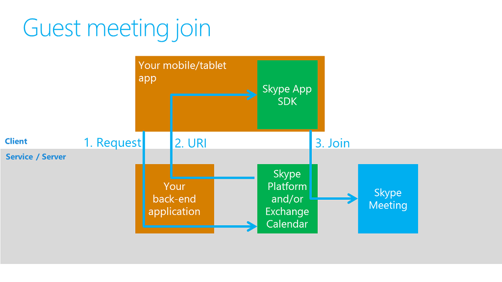

# Embed Skype business-to-consumer communications in your mobile app

Figure 1. Guest  meeting join

## Communication via a Skype for Business meeting

The app uses the SDK's "guest meeting join" or "anonymous meeting join" capability. Note that while the user is anonymous from the Skype for Business viewpoint, the app may well know who the user is and will authenticate the user against its own back-end authentication systems, before joining the user to the meeting. 

## Skype server platform considerations

The Skype for Business App SDK supports joining meetings that are hosted on an **on-premise Skype for Business server** or **Skype for Business Online** server. The callflows for either
platform require that your app gets a meeting identifier. In the online scenario, you will also need a server **Discovery URL** and an anonymous authentication token. 

## Online Meeting join resources

To join a meeting hosted in Skype for Business Online, you need to get a Discovery URI which references a server resource that discovers the right Skype endpoint to join. You also need 
an anonymous meeting token to gain access to the meeting.

## On-premise Meeting join URL

The way you get a meeting identifier and the format of the identifier depend on which Skype for Business platform the meeting is hosted on.
On-premise meetings are identified by a meeting URL, such as: [https://join.contoso.com/meet/john/BW9Z1MJD]( https://join.contoso.com/meet/john/BW9Z1MJD).  The client app will need to obtain this URL from its own back-end services (which in turn, may obtain it using the Skype for Business server-side APIs).  

This flow is available today.  You can experiment with it by creating a meeting in Skype for Business desktop client (or via Outlook) and then launching the meeting URL on a phone with the Skype for Business mobile app installed on it.  

## On-premise steps
 
1. Write a back-end application to handle client “visits”:
   * Receive a request from your client app, _initially via your own back channel_.
   * Verify the visitor.
   
2. Use your back-end application to get a meeting URL such as https://join.contoso.com/meet/john/BW9Z1MJD:
   * Get this via calendar metadata (for pre-scheduled meetings) or on-demand via our APIs (User API / UCWA).
   * Pass the URL (and token) up to your client app and into the App SDK.
   
3. Ask the App SDK to join the meeting.
 
## Online Meeting steps

1. Write a middle-tier application that makes RESTful calls to the [Trusted Application API](../Trusted-Application-API/docs/Overview.md)
   * Receive a request from your client app to get a meeting join URL
      * Pass the meeting join URL to your client app
   * Receive a request from your client app to get a discovery URI and an anonymous meeting join token.
      * Pass the discovery URI and token to your client app

2. Ask the App SDK to join the meeting by using the resources returned by the middle-tier application.   

## Next steps

- [Getting started with the App SDK](GettingStarted.md)
