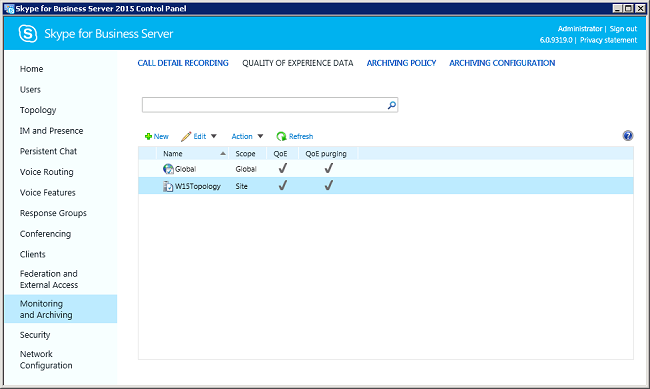
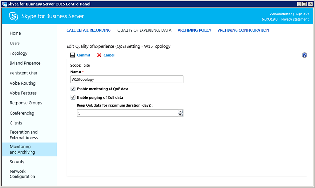

# Activating QoE recording in Skype for Business Server

 **Last modified:** February 23, 2017
  
    
    

 * **Applies to:** Lync Server 2013 | Skype for Business 2015

If Quality of Experience (QoE) recording has not been activated in the Skype for Business monitoring server, you must activate it before installing the Skype for Business SDN Interface. You can verify and activate the QoE recording in one of the two ways: 
  
    
    


- Using the Skype for Business Server Management Shell commands 
    
  
- Using the Skype for Business Server control panel 
    
  

## Verify and activate QoE recording using Management Shell commands

To verify the QoE recording using Skype for Business Server Management Shell commands, open a Management Shell command prompt on a Skype for Business Server computer and issue the following Windows PowerShell command. 
  
    
    

```

Get-CsQoEConfiguration -Identity site:W15Topology
```

In our example, "W15Toplogy" is the site name assigned to the Skype for Business Server deployment. If the  `EnableQoE` attribute is set to `True` in the returned result, the QoE recording has been activated. If the `EnableQoE` attribute is `False`, issue the following Windows PowerShell command to activate the QoE recording. 
  
    
    


```
Set-CsQoEConfiguration -Identity site:W15Topology -EnableQoE $True

```

For detailed information about the Windows PowerShell commands, see  [Skype for Business Server 2015 Management Shell](https://technet.microsoft.com/en-us/library/gg398474.aspx). 
  
    
    

## Verify and activate QoE recording using the Skype for Business Server Control Panel

To verify the QoE recording using the Skype for Business Server control panel, start the control panel and select the **Monitoring and Archiving** tab on the navigation pane, then select the **Quality of Experience Data** tab.
  
    
    

**Figure 1. Skype for Business Server Control Panel showing QoE activation setting**

  
    
    

  
    
    

  
    
    
If the QoE column of the specified topology (W15Topology) is checked, the QoE recording is activated. Otherwise, choose the **Edit** menu option and select the **Enable monitoring of QoE data** checkbox for the specified Skype for Business Server topology. We recommend that you also select the **Enable purging QoE data** checkbox and specify a maximum number of days to keep the QoE data before purging.
  
    
    

****

  
    
    

  
    
    

  
    
    

    
> [!NOTE]
> Some of the parameters might not be available in the control panel. To view and set such advanced features, use the Windows PowerShell commands. For more information about the Windows PowerShell commands, see  [Configuring SDN Interface using the command prompt](configuring-sdn-interface-using-the-command-prompt.md). 
  
    
    


