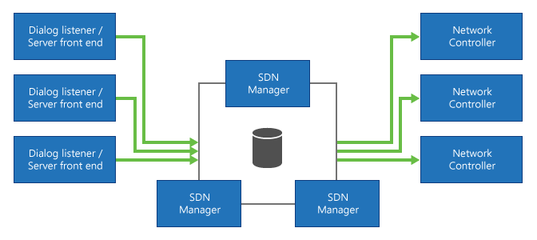
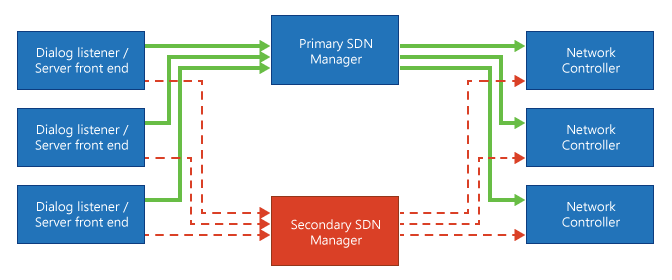
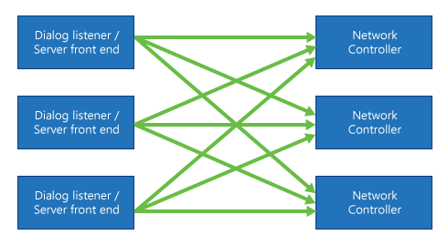

# Deploying Skype for Business SDN Interface

 **Last modified:** February 22, 2017
  
    
    

 * **Applies to:** Lync Server 2013 | Skype for Business 2015

Microsoft Skype for Business SDN Interface supports different deployment scenarios with noteworthy differences and trade-offs. Regardless of the deployment topology you choose, always install the Dialog Listener components on all the Skype for Business Server front ends; these front ends can be Lync Server versions 2010 or later, including Skype for Business Server 2015. 
  
    
    

## Deploying Skype for Business SDN Interface with an SDN Manager pool

In a Skype for Business SDN Interface pool configuration, all Dialog Listeners are connected to a DNS load-balanced pool of SDN Manager servers. 
  
    
    
In this configuration, the size of the pool scales with the message load produced by the Skype for Business Servers and Dialog Listeners. The pool automatically handles most server failures, but requires a data store to maintain a shared and consistent state among all the SDN Managers in the pool. The data store itself can be SQL Server database or a Redis cache system. Subscribers, like network controllers connected to this SDN Manager pool receive a consistent state about applicable media streams handled by the connected Skype for Business Server front end pools. The setup provides the option for a disaster pool failover configuration. If all SDN Manager instances in a pool are unreachable, Dialog Listeners may be configured to fail-over to an alternative pool. 
  
    
    

**Figure 1. Deployment of Skype for Business SDN Interface with a pool of SDN Managers**

  
    
    

  
    
    

  
    
    

  
    
    

  
    
    

## Deploying Skype for Business SDN Interface with a single SDN Manager

In this simple configuration, all Dialog Listeners are connected to a single SDN Manager component. The SDN Manager service maintains its call state information in memory and a database is not required. This configuration is useful when the call load is under the limit that a single SDN Manager can support and fault-tolerance is not required. 
  
    
    

## Deploying Skype for Business SDN Interface with primary and secondary failover

To overcome server failures in a single SDN Manager deployment, the SDN Interface can take a second SDN Manager as a failover alternate for all the connected Dialog Listeners. When a disconnected Dialog Listener attempts to deliver messages to the primary SDN Manager, a failover protection algorithm will switch to the alternative SDN Manager to ensure that the SDN Interface provides continuous service when server failures occur. In this case, the alternate SDN Manager becomes the new primary service provider. Call states are lost during the failover transition, because state is kept in memory on the primary SDN Manager. This may cause inconsistent or incomplete message reporting delivered to subscribers until the new active SDN Manager can establish a consistent view of the ongoing media streams. 
  
    
    

> [!NOTE]
> In the event of fail over, the secondary computer is promoted to the new primary node. Restoring the second node will automatically make it the secondary node, and the new primary node will stay in place until it fails over. 
  
    
    

**Figure 2. Deployment of SDN Interface with primary and secondary SDN managers**

  
    
    

  
    
    

  
    
    

  
    
    

  
    
    

## Deploying Skype for Business SDN Interface with SDN Manager and Dialog Listener collocated

In this configuration, both the SDN Manager and the Dialog Listener are installed on the Skype for Business Server front end. Call states are usually maintained in memory and they are not shared with other SDN Managers. The collocated SDN Manager can only report on calls from endpoints managed by the hosting Skype for Business Server, and if the clients stay connected to the same front end during a call. 
  
    
    
Often, two different Skype for Business front end servers are involved in handling a call, each receiving different quality data. The SDN Manager won't be able to correlate these messages and a subscriber to both SDN Manager instances will get duplicate messages and might need to merge quality information to get a complete picture of the active media streams. Adding an SDN Manager to the Skype for Business Server will further increase the load (CPU, memory, and possibly network) on these servers. 
  
    
    
When the SDN Manager and the Dialog Listeners are installed on several Skype for Business Server front ends, basically disconnected from each other, the SDN Interface supports sharing the settings for all these components. In this case, an SDN Manager would provide a dedicated configuration service. 
  
    
    

**Figure 3. Deployment of the SDN Interface collocated with SDN manager and dialog listener**

  
    
    

  
    
    

  
    
    

  
    
    

  
    
    

## Additional resources

-  [Understanding Skype for Business SDN Interface](understanding-sdn-interface.md)
    
  
-  [Skype for Business SDN Interface Schema Reference](skype-for-business-sdn-interface-schema-reference.md)
    
  

