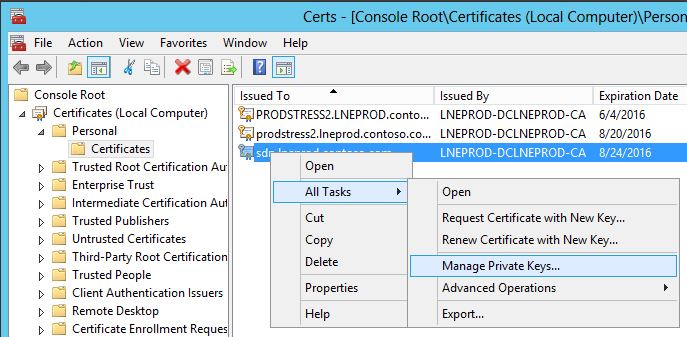
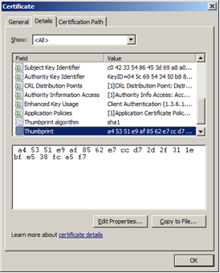

# Installing security certificates

 **Last modified:** August 17, 2015
  
    
    

 * **Applies to:** Lync Server 2013 | Skype for Business 2015

To ensure secure message transport and client authentication, the Skype for Business SDN Interface components support mutual transport layer security (TLS). But for this to work, you must request certificates from an appropriate certification authority. These certificates are needed for the SDN Manager, the Dialog Listener, and for subscribers. You might also have to install a root certificate of the certification authority (CA), if it is not trusted. 
  
    
    

 You will need to use a client certificate on each front-end server in the Dialog Listener and a server certificate on each SDN Manager for the SDN Manager pool fully qualified domain name. In addition, you must install a server certificate on the subscribers, and also an appropriate client certificate on the SDN Manager host computers so you can authenticate it to the subscribers. Finally, you need to ensure that the Windows communication foundation (WCF) configuration of the SDN Manager validates the client certificates set on the Dialog Listeners.To install certificates, you will follow this general approach: 
1. Request a certificate from a certificate server of the correct type 
    
  
2. Install the server certificate on a server for each SDN Manager and subscriber. 
    
  
3. Install client certificates on all clients which are Dialog Listeners so they can talk with the SDN Manager, as well as on all SDN Manager instances so they can talk with subscribers acting as a server (if that subscriber requires authentication via client certificate). 
    
  
4. Install a trusted root certificate on computers where the certificate authority reports it as not trusted. For instructions, see  [Installing the trusted root certificate](installing-the-trusted-root-certificate.md). 
    
  

> [!NOTE]
> You can verify that the SSL and client authentication works independently of Skype for Business SDN Interface by using a general purpose test tool, such as wfetch.exe 
  
    
    

 Detailed instructions for the specific certificate installations are found in the following procedures. In each, assume that a Microsoft Certification Authority is being used. For detailed explanation and instructions on how to create a certificate request for Microsoft Certificate Services, see [Managing Certificate Services and SSL](http://technet.microsoft.com/en-us/library/bb727098.aspx). 
## Requesting and installing a certificate
<a name="requestCertificate"> </a>

The following example demonstrates how to request a certificate from a Windows Certificate Server and your security policies and available templates at your certificate service may be different. 
  
    
    

1. In your web browser, navigate to your certification server (for example,  `http://<servername>/certsrv`). This should be the same certificate authority that is used to generate certificates for the client. 
    
  
2. Choose the **Request a certificate** link.
    
  
3. Choose the **Advanced certificate request** link.
    
  
4. Choose the **Create and submit a request to this CA** link.
    
  
5. In the **Certificate Template** dropdown, select the **Exportable Server Cert** option for a server certificate or appropriate template for the client certificate.
    
  
6. When creating the server certificate, specify the fully qualified domain name as the certificate **Name**, as well as its **Friendly Name**. Other fields can remain blank or retain their default values. 
    
  
7. Choose **Submit**. 
    
  
8. Choose the Install this Certificate link. The certificate will be installed to the **Certificates-Current User\\Personal\\Certificates** folder.
    
  
9. Start MMC and add the certificate snap-ins shown in step 8 of the  [Installing the trusted root certificate](installing-the-trusted-root-certificate.md) section in the [Appendix](appendix.md). 
    
  
10. Move the certificate from the **Certificates-Current User\\Personal\\Certificates** folder to the **Certificates Local computer\\Personal\\Certificates** folder.
    
  
11. Ensure that the processes have access to the entire certificate, including its private key. This might require adding the network service (or other credential that runs the service) to the certificate as shown in figures 1 and 2. 
    
   **Figure 1. Adding a service to the certificate, part 1**

  


  

   **Figure 2. Adding a service to the certificate, part 2**

  


  

  

  

## Installing certificates for use with SDN Manager
<a name="requestCertificate"> </a>

You must install certificates on the SDN Manager in order to do the following: 
  
    
    

- Authenticate and secure communications between possibly multiple Dialog Listeners and a SDN Manager. (Applies to server certificates.) 
    
  
- Authenticate and secure communications from SDN Manager to possibly multiple subscribers (for example, network controllers, network management systems, ITPro tools, and so forth). (Applies to client certificates.) 
    
  
Each server certificate must contain the fully qualified domain name of the receiving system. You cannot use an IP address, host name or local addresses (*.local). The certificate must be installed in the local computer store. When client authentication is required by a subscriber system, the client certificate on the SDN Manager might need to contain the fully qualified domain name of the computer that is hosting SDN Manager, depending on how the subscriber third-party system authenticates a client. The certificates must be signed by a certification authority that is trusted by all involved parties. If the certification authority is not trusted, the root certificate of the certification authority must be installed on all involved computers. 
  
    
    
You should follow the standard WCF certificate validation mechanism to configure the settings to validate the client certificates 
  
    
    

> [!NOTE]
> Make sure when using a pool of SDN Managers, the certificate contains the entire pool fully qualified domain name (for example, "sdnpool.contoso.com"). This name should have at least one period delimiter ("."). 
  
    
    


## Assigning a server certificate to a port
<a name="requestCertificate"> </a>

To activate and assign the server certificate to the port used to receive SSL traffic on the SDN Manager, you will need to run the following command: 
  
    
    

```powershell

netsh http add sslcert ipport=0.0.0.0:9332 certhash=<thumb> appid={12345678-1234-ABCD-ABCD-1234567890AB} clientcertnegotiation=<enable or disable> verifyclientcertrevocation=<enable or disable>
```

Replace the  `<thumb>` with the thumbprint of the server certificate associated with the SDN Manager's pool fully qualified domain name. You will also probably need to set `verifyclientcertrevocation=disabled` if you use self-signed certs and `clientcertnegotiation` depending on whether you use client certs on the Dialog Listener.
  
    
    

### Client certificate provisioning

When provisioning subscribers, you can specify the thumbprint of the client certificate in the configuration settings for the specified subscriber. 
  
    
    

> [!NOTE]
> This procedure is necessary only if a subscriber requires client authentication. In this case, the subscriber must be configured to validate and accept the client certificate. When generating the client certificate, you must set the parameters and fields according to the certificate validation policy of the subscriber system. 
  
    
    

To install the client certificate, follow the steps listed in the Requesting and Installing a certificate procedure earlier in this article. The thumbprint of a client certificate must be specified in the **clientcertificateid** property of the subscriber configuration.
  
    
    
You can obtain the thumbprint by using the **Certificate** dialog, as shown in Figure 1.
  
    
    

**Figure 3. Certificate dialog box**

  
    
    

  
    
    

  
    
    

  
    
    

  
    
    

### Authenticating Dialog Listener connections using client certificates

For the SDN Manager to authorize client certificates from the Dialog Listener, you must configure the client certificate validation logic in the SDNManager.exe.config file as specified by the Windows Communication Framework (WCF). 
  
    
    
By default, the SDN Manager uses a simple custom validator for client certificates that it receives from the Dialog Listener. The current SDNManager.exe.config file contains the configuration for this custom accept-and-log client certificate validator. WCF then ensures that a certificate is consistent and valid before the validator is called. This validator ( **AcceptAndLogValidator**) logs information from the certificate and always accepts it. 
  
    
    
For an increased security, you must configure a different validator for client certificates by using standard WCF configuration mechanisms. The following example shows the WCF configuration for the **AcceptAndLogValidator**: 
  
    
    


```xml

<serviceBehaviors>
        <behavior name="CustomValidator">
            <serviceCredentials>
               <clientCertificate>
                  <authentication certificateValidationMode="Custom" customCertificateValidatorType="Microsoft.Rtc.Enlightenment.Hub.AcceptAndLogValidator, SDNManager" />
               </clientCertificate>
            </serviceCredentials>
        </behavior>
</serviceBehaviors>

```


### Authenticating the Server Certificate on the DL

For increased security you may want to activate server certificate revocation list checking. Per WCF, you can configure this by adding the following configuration file parameters in the DialogListener.exe.config file: 
  


```xml

<configuration>
    <system.net>
        <settings>
              <servicePointManager checkCertificateRevocationList="true" />
        </settings>
    </system.net>
</configuration>

```


## Installing certificates for the Dialog Listener
<a name="requestCertificate"> </a>

You must install a certificate on the Dialog Listener to authenticate and secure communication between the Dialog Listener and the SDN Manager. This applies to the client certificate. To install the client certificate, follow the steps listed in the "Requesting and installing a certificate," earlier in this article. 
  
    
    
After installing the certificate, you must provision the Dialog Listener to use the client certificate. You need the thumbprint, as described in section earlier in this article entitled "Client certificate provisioning." For the Dialog Listener, the thumbprint should be provided during the setup or afterwards by editing the  _configurationcertificate_ field in the DialogListener.exe.config file and the _clientcertificateid_ field in the Listener settings.
  
    
    

## Additional resources
<a name="requestCertificate"> </a>


-  [Getting ready to install Skype for Business SDN Interface](getting-ready-to-install-sdn-interface.md)
    
  
-  [Skype for Business SDN Interface Schema Reference](skype-for-business-sdn-interface-schema-reference.md)
    
  

