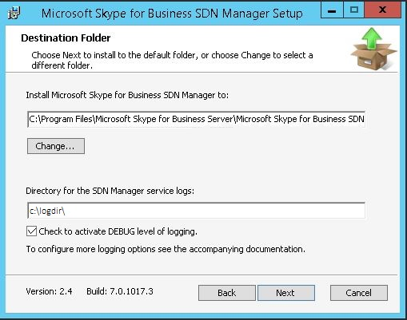
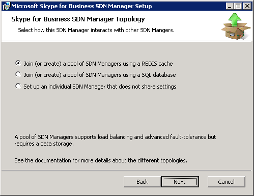
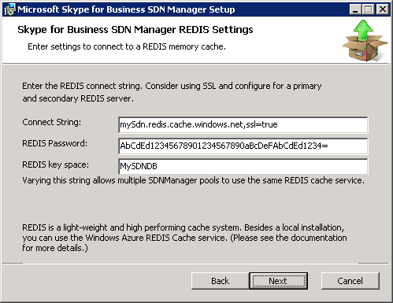
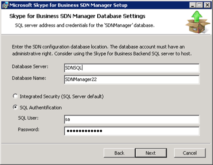

# Installing the SDN Manager

 **Last modified:** February 23, 2017
  
    
    

 * **Applies to:** Lync Server 2013 | Skype for Business 2015

To install Skype for Business SDN Manager, do the following: 
  
    
    

1.  Copy the SDNManager.msi to the server computer that will host the SDN Manager.
    
  
2. Launch the SDNManager.msi. 
    
  
3. In the **Welcome to the Microsoft SDN Manager Setup Wizard**, choose **Next**.
    
  
4. Accept the **End-User License Agreement** and then choose **Next**.
    
  
5. In the **Destination Folder** panel, keep the default or enter a custom SDN Manager installation directory.
    
   **Figure 1. SDN manager destination folder**

  

  
  

  

  
6. Do the same for the service logging directory; that is, set it to  `c:\\logdir\\`, then select the checkbox to enable debug level logging. 
    
   > [!NOTE]
   > While the number of log files is limited, for production environments it is not recommended that you activate debug logging unless investigating a particular issue, as extensive amounts of logs are written. 
7. On the **SDN Manager Topology** wizard screen, select one of the three available options:
    
  - Join (or create) a pool of SDN Managers using a REDIS cache 
    
  
  - Join (or create) a pool of SDN Managers using a SQL Server database. 
    
  
  - Set up an individual SDN Manager that does not share settings. 
    
  

   **Figure 2. SDN manager topology**

  

  
  

    
   > [!NOTE]
   > To download and install Redis, visit the  [Redis web site](http://redis.io/). 
8. Depending on your choice, select one of the following: 
    
1. If the first option is selected, do the following: 
    
  In the **REDIS Settings** wizard page (Figure 3), enter the connect string to a Redis cache service. You can enter the password, if required, as part of the connect string, or else enter the password in the separate **Password** field.
    

   **Figure 3. REDIS settings wizard screen**

  

  
  

    
    
    
   > [!NOTE]
   > **REDIS key space** field prevents multiple clients from using the same key, causing applications to interfere with one other. If you intend to use this cache for multiple SDN pools or other application, please ensure that each one has a different key space value.
2. If you selected the second option (Join (or create) a pool of SDN Managers using a SQL Server database), do the following: 
    
  - In **Skype for BusinessSDN Manager Database Settings** wizard page, enter a SQL Server name in the **Database Server** field, and the database instance name, if appropriate, in the **Database Name** field.
    
   **Figure 4. SDN manager database settings**

  

  
  

  

  
  - Select either the **Integrated Security** or **SQL Authentication** to specify the credentials that the SDN Manager uses to access the database. Make sure to use the credentials with the sufficient privileges to access, create and configure the database. Then choose **Next**. 
    
  
  - After the installer has successfully contacted the database server, it will either create a new SDN Manager database with the specified name or connect to an existing one. Choose **Next**. 
    
  
  - In **Skype for Business SDN Manager Database Settings** wizard page, choose the credentials the SDN Manager will use to access the SQL Server database during operation.
    
  
3. If the third option is selected, no further settings are needed as the single SDN Manager instance will use its internal memory cache for tracking all ongoing call sessions. 
    
   > [!NOTE]
   > If you choose this final option please ensure that the SDN Manager host has sufficient memory for all concurrent ongoing sessions, 
9. In the **Ready to install** panel, click the Install button to start the installation.
    
  
10. In the wizard completed panel, click **Finish** to exit the installation wizard.
    
  

## Additional resources

-  [Installing the SDN Manager](installing-the-sdn-manager.md)
    
  
-  [Skype for Business SDN Interface Schema Reference](skype-for-business-sdn-interface-schema-reference.md)
    
  

