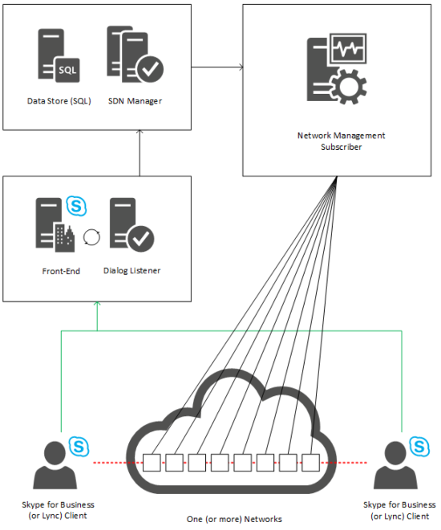
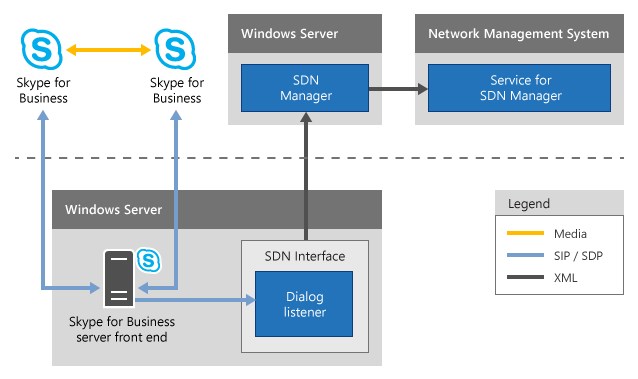

# Skype for Business SDN Interface architecture

 **Last modified:** February 22, 2017
 * **Applies to:** Lync Server 2013 | Skype for Business 2015
 
Conceptually, the Skype for Business SDN Interface consists of the following components:
  
    
    

- A Dialog Listener that captures signaling and quality observations about media traffic between Skype for Business endpoints.
    
  
- An SDN Manager that collects the data from one or more Dialog Listener and distributes to third-party network management systems.
    
  
- A data store that maintains the shared state among all SDN Managers in a single pool.
    
  
- One or more subscribers, generally network management systems, also known as network controllers, or ITPro tools that support a RESTful web service to receive and analyze the call- and media-quality data posted from the SDN Manager.
    
  

## Skype for Business SDN Interface infrastructure

At a high level, the Skype for Business SDN Interface infrastructure consists of the SDN Manager, the Dialog Listener/Skype for Business Server front end and a network controller. It also includes Skype for Business clients and one or more networks in an infrastructure cloud.
  
    
    

**Figure 1. Skype for Business SDN Interface architecture**

  
    
    
The types of Skype for Business media traffic involving two or more Skype for Business endpoints include audio and video calls and application sharing.
  
    
    
The Dialog Listener is implemented as a Windows service, can work with Lync Server 2010, Lync Server 2013, and Skype for Business 2015, and requires .NET Framework 4.5 or later versions. The Dialog Listener is configured to send data to the SDN Manager. 
  
    
    
The SDN Manager is also a lightweight Windows service that we recommend you run on a separate virtual or hardware application server that uses Windows Server 2008 or later (see  [Deploying Skype for Business SDN Interface](deploying-the-sdn-interface.md)). The SDN Manager is responsible for processing the various events received from the Dialog Listener. It maintains state of the individual real-time streams—including whether the stream has started, ended, updated, and more in the associated data store (either Redis, local cache)—and sends the resulting XML data to the configured data receivers. The SDN Manager requires .NET Framework 4.5 or a later.
  
    
    
Upon receiving a relevant message on the Skype for Business Server front end computers, the Dialog Listener forwards essential parts of the message to the SDN Manager, which raises an event and invokes an event handler to parse the captured messages. Furthermore, it selects those properties related to the quality of the audio, video, and application sharing media streams between Skype for Business endpoints. The SDN Manager then posts the data in an XML format to the registered receiver (or subscriber), for example, network management systems or network controller, and also makes relevant log entries at the same time.
  
    
    
A subscriber runs independently of the SDN Manager and its underlying Skype for Business Server environment. It uses a web service to receive as input the Skype for Business call and quality data captured by the SDN Manager. The web service must be configured as a subscriber in the SDN Manager so that it can post the Skype for Business call and quality data to the configured web service address. In the current Skype for Business version, this web service address as well as other configuration data is stored in a "Subscriber" structure for each such receiver.
  
    
    
A subscriber can be a network controller which monitors and analyzes network elements and traffic for the Skype for Business clients, in addition to various other kinds of network traffic. More specifically, when a Skype for Business user calls another Skype for Business user, a SIP dialog is established. SIP messages are exchanged between the client and Skype for Business Server. Specific SIP messages contain data reflecting media-related events relevant for Skype for Business SDN Interface and are forwarded to the SDN Manager. The SDN Manager is then responsible for verifying, combining and packaging the call and quality data in XML and posting them to the web services. Figure 2 shows this process.
  
    
    

**Figure 2. Detailed Skype for Business SDN Interface architecture**

  
    
    

  
    
    

  
    
    

  
    
    

  
    
    

## Additional resources

-  [Understanding Skype for Business SDN Interface](understanding-sdn-interface.md)
    
  
-  [Skype for Business SDN Interface Schema Reference](skype-for-business-sdn-interface-schema-reference.md)
    
  

