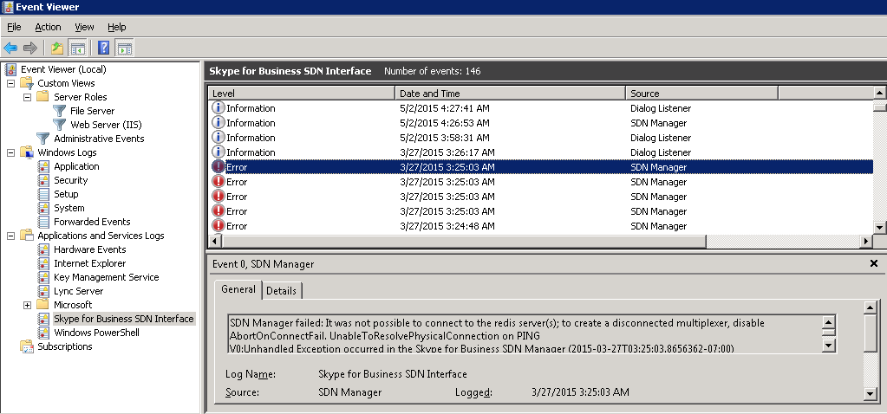

# Monitoring the SDN Manager and Dialog Listener

 **Last modified:** June 11, 2015
  
    
    

 * **Applies to:** Lync Server 2013 | Skype for Business 2015

In addition to supporting internal logging, the Dialog Listener and SDN Manager also send events to the Windows event log. This lets you monitor the operational status of the Skype for Business SDN Interface components by examining event entries in the Windows Event Viewer (Figure 1). For example, the operational status message reports that the SDN Manager or Dialog Listener service has started or stopped and also report error conditions that include connection failures to the Skype for Business Server and database, or between the SDN Manager and Dialog Listener. 
  
    
    

**Figure 1. Windows Event Viewer**

  
    
    

  
    
    

  
    
    

  
    
    

  
    
    

