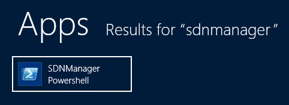

# PowerShell Provisioning
Learn to use Skype SDN Interface Powershell commands. 
 **Last modified:** February 24, 2017
  
    
    

 * **Applies to:** Lync Server 2013 | Skype for Business 2015

## PowerShell Provisioning

After the installation of SDN Manager, the Windows Start Menu contains an SDN Manager PowerShell link that allows execution of provisioning commands like the command line provisioning interface. 
  
    
    
The SDN Interface PowerShell can be accessed from any SDN Manager in the SDN Manager pool by clicking on "SDNManager Powershell" under the Windows Start menu as seen in the screenshot below. 
  
    
    

**SDN Manager PowerShell location on Windows Start menu:**

    

  
    
    
Below is the list of SDN Manager PowerShell commands, from "(Get-Command *cssdn*).Name": 
  
    
    
Add-CsSdnListener
  
    
    
Add-CsSdnSubscriber
  
    
    
Get-CsSdnCatalog
  
    
    
Get-CsSdnListener
  
    
    
Get-CsSdnLog
  
    
    
Get-CsSdnManager
  
    
    
Get-CsSdnStatus
  
    
    
Get-CsSdnSubscriber
  
    
    
Get-CsSdnSubscriberStatus
  
    
    
Set-CsSdnListenerParameter
  
    
    
Set-CsSdnManagerParameter
  
    
    
Set-CsSdnSubscriberParameter
  
    
    
Remove-CsSdnListener
  
    
    
Remove-CsSdnSubscriber
  
    
    

  
    
    
Example output for Add-CsSdnListener -SdnPoolUri http://localhost:9333/Settings -Identifier SdnPool.CONTOSO.COM 
  
    
    


```powershell

true
```

Example output for Get-CsSdnCatalog -SdnPoolUri http://localhost:9333/Settings 
  
    
    


```xml
<Catalog Version="A" xmlns="uctp.skype.microsoft.com" xmlns:s="uctp.skype.microsoft.com">
  <Identity>
    <Name>ProdStress2.LNEPROD.contoso.com</Name>
    <PoolName>MySDNDB</PoolName>
    <Role>UCS</Role>
    <Scope>
    </Scope>
  </Identity>
  <Endpoints>
    <Connection Transport="WebSockets" Encoding="text/xml" />
    <Connection Transport="WebSockets" Encoding="application/json" />
  </Endpoints>
  <Topic Name="LyncDiagnostics" Version="1.0" Schemas="SDNInterface.Schemas.D">
    <Element Name="SendRawSDP" Version="2.0" />
    <Element Name="Quality" Version="2.0" />
    <Element Name="Signaling" Version="2.0" />
    <Element Name="ObfuscationSeed" Version="2.0" />
  </Topic>
  <Topic Name="VQ" Version="1.0" Schemas="ms-rtcp-metrics,ms-rtcp-metrics.v2,ms-rtcp-metrics.v3,ms-rtcp-metrics.v4,ms-rtcp-metrics.v5">
    <Element Name="ObfuscationSeed" Version="3.0" />
  </Topic>
  <Topic Name="SBCQuality" Version="1.0" Schemas="sbc.uctp.skype">
    <Element Name="DeviceOverview" />
    <Element Name="Addressing" />
    <Element Name="UserInfo" />
    <Element Name="Summary" />
    <Element Name="Update" />
    <Element Name="Attempt" />
  </Topic>
  <Topic Name="NCQuality" Version="1.0" Schemas="nc.uctp.skype">
  </Topic>
</Catalog>

```

Example output for Get-CsSdnListener -SdnPoolUri http://localhost:9333/Settings -Identifier SdnPool.CONTOSO.COM 
  
    
    


```xml

<Configuration Version="2.0" culture="en-US" Kind="Listener" Identifier="SDNPOOL.CONTOSO.COM" LastModified="2016-12-30T01:05:19.5514775Z">
  <parameter key="submituri">http://localhost:9333/LDL/</parameter>
  <parameter key="alternativeuri" />
  <parameter key="clientcertificateid" />
  <parameter key="submitqueuelen">1000</parameter>
  <parameter key="maxbackoff">30</parameter>
  <parameter key="maxdelaylimit">5</parameter>
  <parameter key="maxopen">100</parameter>
  <parameter key="maxretry">100</parameter>
  <parameter key="maxretrybeforefailover">10</parameter>
  <parameter key="Created">2016-12-29T17:05:19.5358543-08:00</parameter>
</Configuration>

```

Example output for Get-CsSdnLog -SdnPoolUri http://localhost:9333/Settings -Identifier lneapplog 
  
    
    


```xml

<Log>2016-12-29T15:06:18.7226346-08:00 [Info] Skype for Business SDN Manager service started. EventId: 101 Category: 3

...
</Log>

```

Example output for Get-CsSdnLog -SdnPoolUri http://localhost:9333/Settings -Identifier siphonstate 
  
    
    


```xml

<SiphonState Version="1.0" />
```

Example output for Get-CsSdnLog -SdnPoolUri http://localhost:9333/Settings -Identifier serverstate 
  
    
    


```xml
<ServerStates Version="1.0">
</ServerStates>

```

Example output for Get-CsSdnLog -SdnPoolUri http://localhost:9333/Settings -Identifier connections 
  
    
    


```xml

<Connections Version="1.0" />
```

Example output for Get-CsSdnLog -SdnPoolUri http://localhost:9333/Settings -Identifier config 
  
    
    


```xml
<Config Version="1.0">
  <add key="configurationserviceuri" value="http://localhost:9333/Settings" />
  <add key="checkdns" value="False" />
  <add key="configurationrefresh" value="00:00:50" />
  <add key="mode" value="Database" />
  <add key="statedbserver" value="dblneprod" />
  <add key="statedbname" value="SDNManager22" />
  <add key="identifier" value="MySDNDB" />
  <add key="usedapi" value="False" />
</Config>

```

Example output for Get-CsSdnManager -SdnPoolUri http://localhost:9333/Settings 
  
    
    


```xml

<Configuration Version="2.0" culture="en-US" Kind="Manager" Identifier="DEFAULT" LastModified="2016-12-29T23:06:18.4101308Z">
  <parameter key="calltimeout">1.00:00:00</parameter>
  <parameter key="endedtimeout">00:00:15</parameter>
  <parameter key="invitetimeout">00:03:00</parameter>
  <parameter key="maxcachesize">20000</parameter>
  <parameter key="qoetimeout">00:00:05</parameter>
  <parameter key="timeouthandlerperiod">00:00:10</parameter>
  <parameter key="hidepii">True</parameter>
  <parameter key="applicationsharing-AppliedBandwidthLimitAcceptable">500000</parameter>
...
  <parameter key="video-VideoPostFECPLROptimal">0.05</parameter>
</Configuration>

```

Example output for Get-CsSdnStatus -SdnPoolUri http://localhost:9333/Settings 
  
    
    


```xml

<Status Version="1.0">
  <UpTime>1:59:01.1725951</UpTime>
  <SinceLastRequest>00:00:10.2136107</SinceLastRequest>
</Status>

```

Example output for Get-CsSdnSubscriber -SdnPoolUri http://localhost:9333/Settings -Identifier MySubscriber 
  
    
    


```xml

<Configuration Version="2.0" culture="en-US" Kind="Subscriber" Identifier="MYSUBSCRIBER" LastModified="2016-12-30T01:05:19.5671027Z">
  <parameter key="submituri">http://localhost:9333/Log/poststuffhere</parameter>
  <parameter key="outputschema">D</parameter>
  <parameter key="clientcertificateid" />
  <parameter key="domainfilters" />
  <parameter key="subnetfilters" />
  <parameter key="tenantfilters" />
  <parameter key="trunkfilters" />
  <parameter key="quality">True</parameter>
  <parameter key="signaling">False</parameter>
  <parameter key="sendrawsdp">False</parameter>
  <parameter key="maxbackoff">30</parameter>
  <parameter key="maxdelaylimit">5</parameter>
  <parameter key="maxopen">100</parameter>
  <parameter key="maxretry">100</parameter>
  <parameter key="submitqueuelen">1000</parameter>
  <parameter key="obfuscationseed" />
  <parameter key="schemaextension">true</parameter>
  <parameter key="Created">Manual</parameter>
</Configuration>

```

Example output for Get-CsSdnSubscriberStatus -SdnPoolUri http://localhost:9333/Settings -Identifier MySubscriber 
  
    
    


```xml

<Status Version="2.0" Subscriber="MYSUBSCRIBER">
  <SDNManager>ProdStress2.LNEPROD.contoso.com</SDNManager>
  <SDNManagerVersion>3.0 7.0.1459.1</SDNManagerVersion>
  <ServiceUri>http://localhost:9333/Log/poststuffhere</ServiceUri>
  <IPs>::1,127.0.0.1</IPs>
  <Connection>
    <Uptime>0:00:00.1874999</Uptime>
    <DeliveredMessages>0</DeliveredMessages>
    <ReceivedMessages>0</ReceivedMessages>
    <DroppedMessages>0</DroppedMessages>
    <QueueLength>0</QueueLength>
    <OpenRequests>0</OpenRequests>
    <CallsQueued>0</CallsQueued>
    <RecentFailedMessages>0</RecentFailedMessages>
    <FailedMessages>0</FailedMessages>
    <LastError />
    <LastErrorTimeStamp>N/A</LastErrorTimeStamp>
    <LastMessageSent>2016-12-29T17:05:19.5671031-08:00</LastMessageSent>
    <LastMsgDelivered>N/A</LastMsgDelivered>
  </Connection>
</Status>

```

Example output for Set-CsSdnListenerParameter -SdnPoolUri http://localhost:9333/Settings -Identifier SdnPool.CONTOSO.COM -Parameter submitqueuelen -Value 2000 
  
    
    


```powershell

True
```

Example output for Set-CsSdnManagerParameter -SdnPoolUri http://localhost:9333/Settings -Parameter hidepii -Value True 
  
    
    


```powershell
True
```

Example output for Set-CsSdnSubscriberParameter -SdnPoolUri http://localhost:9333/Settings -Identifier MySubscriber -Parameter maxopen -Value 101 
  
    
    


```powershell
True
```

Example output for Remove-CsSdnListener -SdnPoolUri http://localhost:9333/Settings -Identifier SdnPool.CONTOSO.COM 
  
    
    


```powershell
True
```

Example output for Remove-CsSdnSubscriber -SdnPoolUri http://localhost:9333/Settings -Identifier MySubscriber 
  
    
    


```powershell
True
```


