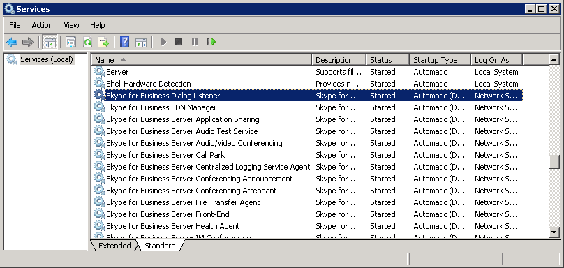
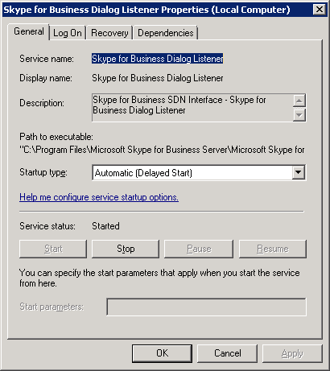

# Running the SDN Interface Dialog Listener

 **Last modified:** February 23, 2017
  
    
    

 * **Applies to:** Lync Server 2013 | Skype for Business 2015

This section describes how to run the Dialog Listener as a Windows service and console application. 
  
    
    

The Dialog Listener setup wizards install, configure, and start the Dialog Listener as a Windows service. With the default configuration, the service is set to start automatically. You can restart it after the configuration is changed or when the service fails. You can use the Windows Services panel to verify the service and reconfigure it. The Windows Services panel lets you change the credentials that you use to run the service. These credentials are used to access the Skype for Business, as long as the service is run from an account that is in the  *RTC Server Applications*  group and granted the logon as service rights in the local Group Policy.In general, the Dialog Listener executes as Windows service. In some case, particularly for debugging and for replay, you can run the Dialog Listener as a console application from the command prompt. 

> [!NOTE]
> When Dialog Listener is installed, the Front End service (RTCSRV) service cannot be controlled via SfB Control Panel. Either the RTCSRV service will not stop, or the DialogListener service will not be started. Changes to the FE server availability should be accomplished via server start/stop/restart. > The Windows Services application (services.msc) or SC.exe command line program, can be used as an alternative to the Skype for Business Control Panel. 
  
    
    

> [!NOTE]
> Unlike the SDN Manager, you cannot run the service and the command line tool at the same time. 
  
    
    

## Running Dialog Listener as a Windows service

1. Start the Windows Services application as shown in Figure 1. 
    
  
2. Locate the Dialog Listener entry. 
    
   **Figure 1. The Windows services window**

  

  
  

  

  
3. If Dialog Listener is not already started, right-click the entry to select the **Properties** menu item. Click **Start** to restart the service, then click **OK** after the service is restarted.
    
   **Figure 2. Dialog listener properties dialog box**

  

  
  

  If the service does not start, you may need different user credentials. The user must also be in the local  *RTC Server Applications*  security group. You can change the user credentials to run the service by using the Dialog Listener **Properties** dialog box as shown in Figure 2.
    
  

## Running the Dialog Listener as a console application

To run the Dialog Listener as a console application, launch DialogListener.exe without any parameter; this starts the service as a console application. 
  
    
    
Running the Dialog Listener as a console application gives you more feedback from the Dialog Listener service, in particular around issues related to startup and connecting to the Skype for Business Server. It also helps you identify credential-related issues pertaining to the Dialog Listener having appropriate access rights. 
  
    
    

