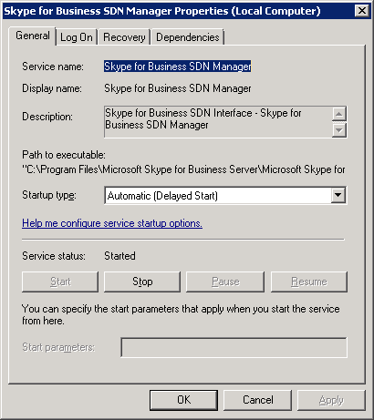

# Running the SDN Interface SDN Manager

 **Last modified:** June 11, 2015
  
    
    

 * **Applies to:** Lync Server 2013 | Skype for Business 2015

This section describes how to run Skype for Business SDN Manager as a Windows service and as a console application. 
  
The SDN Manager setup wizard will install, configure, and start SDN Manager service. By default, the SDN Manager service is configured to run automatically. However, you may need to restart the service after changing the settings or if the service fails. Open the Windows Services utility to determine whether the service is running and, if not, reconfigure and start it. The Windows Services panel also let you change the credentials that are used to run the service. In general, you run the SDN Manager as a Windows service. In some cases, especially for debugging, you may want to run the SDN Manager as a console application. 

## Running the SDN Manager as a Windows service

1. Start Windows Services utility. 
    
  
2. Search for SDN Manager entry. 
    
  
3. If SDN Manager is not already started, right-click the entry to select the **Properties** menu item. Click **Start** to restart the service. Click **OK** after the service is restarted.
    
   **Figure 1. SDN Manager properties dialog box**

  

  
  

    
> [!NOTE]
  You can control the service using the windows **net** or **sc** commands, for example, `sc start "Skype for Business SDN Manager"`. 

## Running the SDN Manager as console application

Start SDNManager.exe without any parameter and it will start the SDN Manager service in a console application. 
  
    
    

> [!NOTE]
> If you specify any command line parameter, SDN Manager will not start as a service but instead attempts to execute specified command line arguments in an active SDN Manager instance or pool. 
  
    
    

