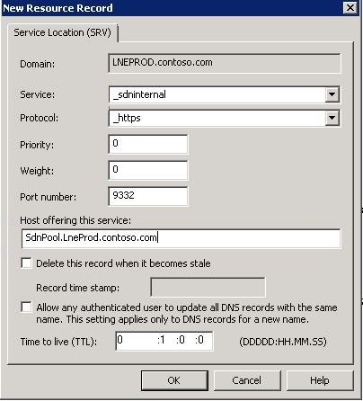

# Setting up a DNS service location record

 **Last modified:** February 24, 2017
  
    
    

 * **Applies to:** Lync Server 2013 | Skype for Business 2015

You can configure the Skype for BusinessDialog Listener to query DNS for the location of the single host or pool of SDN Manager service, if the DNS service location record was created properly. This article explains how to create the service location records. You must have domain administrator privileges to do this. 
  
> [!NOTE]
> When DNS service location records are used by the Dialog Listener by setting  `checkdns=true` in the configuration file, any configured value for the parameter _configurationserviceuri_ is ignored. The URI specified in the service location record is used instead.
  
    
    


## To set up the DNS service location record


  
    
    

1. Log on to the DNS server and open the DNS Manager. 
    
  
2. Open **DNS** and choose the zone to create the service location record for (Current domain, forward lookup zone).
    
  
3. From the Context menu, select **Other New Records ...**, navigate to **Service Location**, and choose **Create Record**.
    
  
4. Fill in the form (shown in Figure 1) by providing the following values: 
    
  - **Service**: `_sdninternal`
    
  
  - **Protocol**: `_http` or `_https`
    
  
  - **Port number**: 9333 (9332 for https)
    
  
  - **Host offering the LSM service**: FQDN of the host computer (for example, `SdnPool.LneProd.contoso.com`) 
    
  

   **Figure 1. New Resource Record dialog box**

  

  
  

    
   > [!NOTE]
   > If both the HTTP and HTTPS protocols are specified, the HTTP service location record is ignored until the HTTPS record is deleted. 
After the service location discovery is configured, the following behavior will occur: 
  
    
    
If the HTTPS protocol is set, the Dialog Listener looks for the **_sdninternal** service address for that protocol. Otherwise, the Dialog Listener attempts to retrieve the address of an SDN Manager service using the HTTP protocol. It then creates a service URL with the service name ("Settings") appended at the end. Here is an example of a resulting URL: `https://SdnPool.contoso.com:9332/Settings`. 
  
    
    
You can enable Dialog Listeners to use the service location record to discover the SDN Manager locations by selecting the appropriate settings in the SkypeForBusinessDialogListener.msi installation wizard, or by editing the DialogListener.exe.config file and setting the following entry: 
  

```xml

<add key="checkdns" value="True"/>
```


## Additional resources


-  [Getting ready to install Skype for Business SDN Interface](getting-ready-to-install-sdn-interface.md)
    
  
-  [Skype for Business SDN Interface Schema Reference](skype-for-business-sdn-interface-schema-reference.md)
    
  

