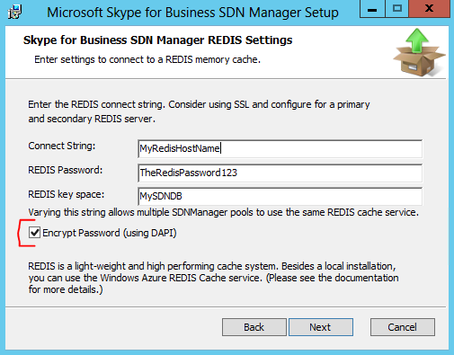

# Unattended installation of SDN Manager and Dialog Listener

 **Last modified:** February 24, 2017
  
    
    

 * **Applies to:** Lync Server 2010 | Lync Server 2013 | Skype for Business 2015

In production, you often have to install the SDN Manager and Dialog Listener using installation scripts, and therefore in an unattended mode. This article describes the parameters that are used for an unattended installation. 
  
## Unattended installation of the SDN Manager
<a name="bk_addresources"> </a>

The following table lists installation parameters for an unattended installation of the SDN Manager. 
  
    
    

> [!NOTE]
> Using unattended installation is an advanced feature. Not all parameters may be validated or report detailed errors. Use regular an installation and logging to investigate any issues you may experience. - for example, include: >  `msiexec /lv* install.log /i SkypeForBusinessSDNManager.msi <your parameters>`
  
    
    

Follow the guidelines for an unattended install: 
  
    
    

- DOMAIN and COMPUTERNAME are required for creating SQL Login and User objects for the local machine. 
    
  
- USE_SQL_AUTH=1 is necessary to declare that sql credentials need to be generated (0 is default). 
    
  
- SQLUSER and SQLPASSWORD are required if USE_SQL_AUTH=1, otherwise ignored. 
    
  
- SQLPASSWORD needs to follow SQL password length and complexity rules. 
    
  
- DATABASE_SERVER is required, and cannot be 'localhost'. 
    
  
- DATABASE_NAME can be defaulted (Default ='SDNManager22'). 
    
  


|**Parameter**|**Description**|
|:-----|:-----|
|INSTALLDIR |Specifies the installation destination for the binaries. |
|LOGPATH |Directory to contain the generated log files |
|TOPOLOGY |describes the desired deployment scenario:|

|**Value**|**Description**|
|:-----|:-----|
|0 |(Cache) Use an in-memory cache for settings and call state |
|1 |Obsolete. Not used. |
|2 |(Database) Use the SDN Manager database to store and share the settings as well as call state. |
|3 |(REDIS) Use a REDIS cache service as a data store for settings and call state. |

|**Parameter**|**Description**|
|:-----|:-----|
|DOMAIN |Domain name. This parameter is required if you set TOPOLOGY=2. |
|COMPUTERNAME |Name of the server that is hosting the SDN Manager. This parameter is required is you set TOPOLOGY=2. The parameter is used to create a machine account in the SQL Server database. |
|DATABASE_SERVER |(e.g. DATABASE_SERVER=ContosoBE\\Monitoring) specifies the SQL Server as well as SQL instance, if appropriate. |
|DATABASE |Name of the database on the SQL Server. The default name is "SDNManager22". |
|SQL_ADMIN_USER |Account to use to create and setup the database. Do not specify when using SQL integrated security with the current user running the setup. |
|SQL_ADMIN_PASSWORD |Password for the SQL admin account if SQL Authentication is used. |
|SQLUSER |Account that is used by the SDN Manager to access the SDN Manager database. |
|SQLPASSWORD |Password for the SQL account if SQL Authentication is used |
|USE_SQL_AUTH |Describes the authentication mode that should be used during run time. |

|**Value**|**Description**|
|:-----|:-----|
|0 |Use integrated security based on the machine account. |
|1 |Use the SQL credentials provided. |
   
|**Parameter**|**Description**|
|:-----|:-----|
|SETUPDB |Setting this parameter to 1 causes the installer to create the SDN ManagerSDN Manager database. This parameter must be set (SETUPDB=1) for the first installation when a database for call state or settings should be created. |
|REDIS_CONNECTSTRING |The connect string to access a REDIS cache server. For example, to connect to Azure the connect string might appear as follows:                     `myname.redis.cache.windows.net,ssl=true,password=VeryLongKeyCopiedFromPortal`For more information, see  [How to Use Azure Redis Cache](http://azure.microsoft.com/en-us/documentation/articles/cache-dotnet-how-to-use-azure-redis-cache/)|
|REDIS_PASSWORD |Password to access the REDIS server. For Microsoft Azure Redis Cache, enter the key provided on the Azure Management panel. |
|USE_DAPI |When set to true ("USE_DAPI=True"), the text specified for REDIS_PASSWORD will be persisted in the SDNManager.exe.config file as a DPAPI encrypted string, and the SDNManager.exe.config file will contain "<add key="usedapi" value="True"/>". Setting is ignored if TOPOLOGY is not '3' - REDIS only. |
   

> [!NOTE]
> Most settings provided during the setup can be modified after installation by editing the SDNManager.exe.config file 
  
    
    

The USE_DAPI parameter is used to secure the Redis password contained in the SDNManager.exe.config file with DPAPI encryption, and corresponds to the checkbox in figure 1: 
  
    
    

**Figure 1. Skype for Business SDN Manager Setup**
    

  

## Example unattended installations of the SDN Manager
<a name="bk_addresources"> </a>

 **Database install**
  
    
    

```powershell
msiexec /i SkypeForBusinessSDNManager.msi /quiet  /lv* install.log LOGPATH=c:\\LogDir TOPOLOGY=2 DATABASE_SERVER=mysqlserver DEBUGLOGGING=All SETUPDB=1 SQL_ADMIN_USER=sa SQL_ADMIN_PASSWORD=mypwd SQLUSER=simpleuser SQLPASSWORD=simplepassword DOMAIN=contoso COMPUTERNAME=thiscomputername USE_SQL_AUTH=1 DATABASE_NAME=sdndb
```

 **REDIS install**
  
    
    


```powershell
msiexec /i SkypeForBusinessSDNManager.msi /quiet  /lv* install.log LOGPATH=c:\\LogDir TOPOLOGY=3 REDIS_CONNECTSTRING=redis.contoso.com,ssl=true REDIS_PASSWORD=myredispwd 
```


## Unattended installation of the Dialog Listener
<a name="bk_addresources"> </a>

Following are unattended installation parameters for the Dialog Listener. 
  
    
    


|**Parameter**|**Description**|
|:-----|:-----|
|INSTALLDIR |Specifies the installation destination for the binaries. |
|CONFIGURATIONURI |URI to locate the SDN Manager or pool that serves the configuration service  `http://localhost:9333/DL`. |
|ACCOUNTYPE |Type of account to run Dialog Listener: "0" for Network Service account and "1" for a user account. |
|APPLIED_SERVICE_USERNAME |Domain/username for the Dialog Listener Windows Service account. |
|APPLIED_SERVICE_PASSWORD |Password for the Dialog Listener Windows Service account. |
|THUMBPRINT |Thumbprint of the client certificate needed to contact the SDN Manager. |
|USE_SRV_RECORD_BOOL |If **true**, then instead of using the configuration service URI, retrieve the location from the DNS SRV record. |
|SKIPREGISTRATION |During the installation, a Windows PowerShell script is executed to register the Dialog Listener with the Skype for Business Server. To skip executing this script, set SKIPREGISTRATION=1.  You must manually perform this registration and start the Dialog Listener Windows service. An **example** of this script can be found under `C:\\ProgramData\\Microsoft\\Skype for Business Dialog Listener\\Register.ps1`. You **MUST** replace the example's CsServerApplication Identity $name construction using '/Diagnostics' with '/SDN22'. The current SDN version only recogizes Identity names constructed with 'SDN22'.
|
   

> [!NOTE]
> Most settings provided during the setup can be modified after the installation by editing the DialogListener.exe.config file 
  
    
    


> [!NOTE]
> When DNS Service Location (SRV) records are used by the Dialog Listener, any configured value for the parameter CONFIGURATIONURI is ignored. Instead, the URI specified in the SRV record is used. 
  
    
    

An installation using the SKIPREGISTRATION=1 option offers an interesting alternative installation. This script executed has three major purposes: Perform the registration of Skype for Business SDN Interface with Skype for Business, so that it forwards request and response messages to the Dialog Listener service, attempt to activate sending of Incall Quality messages (if available), and to start the service itself. 
  
    
    
The registration and activation are only required once for the entire pool and the Dialog Listener Windows service can be started manually as well as using several other options. As the script also uses some lengthy verifications whether the Skype for Business Server is ready and set up correctly, this step could be skipped, speeding up deployment and specifically upgrade processes for experienced administrators. 
  
    
    

## Doing an unattended uninstall
<a name="bk_addresources"> </a>

To do an unattended uninstall, do the following: 
  
    
    

- **For SDN Manager**: In the command line, type `C:\\Windows\\System32\\msiexec.exe /X{60A580F2-7B7A-4665-9696-07BE5D9AF15F}`
    
  
- **For Dialog Listener**: In the command line, type `C:\\Windows\\System32\\msiexec.exe /X{640967B9-CD8D-455F-BAB1-463EBFC51C38}`
    
  

> [!NOTE]
> The product code for the Dialog Listener has changed since the previous release. 
  
    
    


## Additional resources
<a name="bk_addresources"> </a>


-  [Installing the SDN Manager](installing-the-sdn-manager.md)
    
  
-  [Skype for Business SDN Interface Schema Reference](skype-for-business-sdn-interface-schema-reference.md)
    
  
