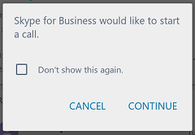

# Starting a call from an Android mobile device

To start a Skype for Business call using an URI from a previous example, your app creates a new _Intent_ using the context of the current activity 
and then provides the Skype URI in the Intent constructor or by calling into the _setURI_ method on the intent.  Call _startActivity(<yourIntent>)_ 
on the context object to start the call.

If the Skype for Business client is not running on the mobile device, it is launched to fulful the calling intent. If your code calls _startActivity_ with an URI formated like "ms-sfb://call?id=user@contoso.com", 
the following dialog opens with the Skype client. If the user checks the **Don't show this again** option, subsequent calls are not prompted for permission.

If the URI is formatted like "ms-sfb://call?id=+1425-555-1234", when the Skype client activity starts, the PSTN phone number is pre-filled
in the Skype dial pad.

 

##Android code example

 The following code is in the _onCreate_ method of an activity with a text entry field and a Skype call button.

 ```java
        Button skypeButton = (Button) findViewById(R.id.button);
        final EditText SIPAddress = (EditText) findViewById(R.id.SIPAddress) ;
        final CheckBox videoCall = (CheckBox) findViewById(R.id.videoCheck);
        skypeButton.setOnClickListener(new View.OnClickListener() {
            @Override
            public void onClick(View view) {

                String uriString = "ms-sfb://call?id="+SIPAddress.getText().toString();
                if (videoCall.isChecked()){
                    uriString +="&video=true";
                }
                Uri uri = Uri.parse(uriString);
                Intent callIntent = new Intent(Intent.ACTION_VIEW, uri);
                startActivity(callIntent);
            }
        } );
 ```
The main activity of the sample application accepts user input for a telephone number to call or the SIP address of a Skype
for Business user. If the user checks the _video call_ check box, the URI query string is appended with a video call parameter.


