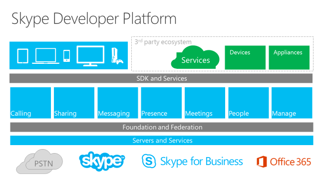

#Skype Developer Platform

 **Last modified:** March 30, 2016

 _**Applies to:** Skype for Business 2015_

 The new Skype Developer Platform provides opportunities to customize and extend the capabilities not only with Skype for Business but also through Skype. Developers no longer have to think about apps only as business solutions and allows for more consumer customization opportunities. Find in-depth developer resources, how-to documentation, SDKs and references, and code samples for Skype developer platform verticals.

 **Documentation**

- [Skype URIs](SkypeURIs/SkypeURIs.md)
- [Skype SDK for Android](SkypeURIs/SkypeSDKforAndroid.md)
- [Skype Web SDK](WebSDK/docs/SkypeWebSDK.md)
- [Skype for Business App SDK Preview](AppSDK/SkypeAppSDK.md)
- [Skype for Business - Mobile URIs](Skype-For-Business-Uris/SfBMobileURI.md)
- [Desktop components](https://msdn.microsoft.com/en-us/library/office/jj933180.aspx)
- [Unified Communications Managed API (UCMA)](https://msdn.microsoft.com/en-us/library/office/dn454984(v=office.16).aspx)
- [Unified Communications Web API](ucwa/UnifiedCommunicationsWebAPI2_0.md)
- [Skype for Business Software Defined Networking (SDN) Interface 3.0](SDN/articles/skype-for-business-sdn-interface.md)

Related sites 
- [Skype](http://www.skype.com/en/)
- [Skype Developer Platform](http://dev.office.com/skype)
- [Introducing Skype for Business](http://blogs.skype.com/2014/11/11/introducing-skype-for-business/)
- [Skype for Business Server 2015](https://technet.microsoft.com/en-us/library/gg398616.aspx)

##Skype Developer Platform composition

##Skype Developer Platform supported topologies

The table lists the supported SDKs and APIs for Skype for Business Server and Skype for Business Online, as well as for Lync 2013.

|**APIs**|**Lync 2013**|**Skype for Business**|**Skype for Business Online**|
|:-----|:-----|:-----|:-----|
|[Skype Web SDK](WebSDK/docs/SkypeWebSDK.md)|Basic|Yes|Yes|
|[Skype for Business App SDK Preview](AppSDK/SkypeAppSDK.md)|Basic|Yes|Yes|
|[Skype for Business - Mobile URIs](Skype-For-Business-Uris/SfBMobileURI.md)|Basic|Yes|Yes|
|[Unified Communications Managed API (UCMA)](https://msdn.microsoft.com/en-us/library/office/dn454984(v=office.16).aspx)|Yes|Yes|No|
|[Unified Communications Web API](ucwa/UnifiedCommunicationsWebAPI2_0.md)|Yes|Yes|Yes|
|[Lync Server 2013 SDK](https://msdn.microsoft.com/en-us/library/office/dn454964.aspx)|Yes|Yes|No|
|[Lync (Client) 2013 SDK](https://msdn.microsoft.com/en-us/library/office/jj933180.aspx)|Yes|Yes|Yes|
|[Lync Server 2013 Persistent Chat SDK](https://msdn.microsoft.com/en-us/library/office/dn454982.aspx)|Yes|Yes|No|
|[Skype for Business Software Defined Networking (SDN) Interface 3.0](SDN/articles/skype-for-business-sdn-interface.md)|Yes|Yes|No|
