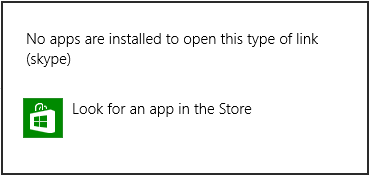
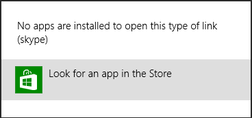

# Skype URI tutorial: Windows 8 apps

Learn how to incorporate Skype communication functionality into your Windows 8 apps.


 _**Applies to:** Skype_

## Use Skype URIs in your Windows 8 apps

You can use Skype URIs in your Windows 8 apps; for example, tapping a contact's picture might start a Skype audio call. 
After you have constructed the appropriate Skype URI, simply set it as the value of  **document.location** to initiate 
its actions.

For an introduction to the Fixed Layout template, see [JavaScript project templates for Store apps](http://go.microsoft.com/fwlink/?LinkId=232508)

 **default.js**


```javascript

(function () {
  "use strict";

  WinJS.Binding.optimizeBindingReferences = true;

  var app = WinJS.Application;
  var activation = Windows.ApplicationModel.Activation;

  app.onactivated = function (args) {
    if (args.detail.kind === activation.ActivationKind.launch) {
      if (args.detail.previousExecutionState !== activation.ApplicationExecutionState.terminated) {
        // TODO: This application has been newly launched. Initialize
        // your application here.
      }
      else {
        // TODO: This application has been reactivated from suspension.
        // Restore application state here.
      }
      args.setPromise(WinJS.UI.processAll());
    }
  };

  app.oncheckpoint = function (args) {
    // TODO: This application is about to be suspended. Save any state
    // that needs to persist across suspensions here. You might use the
    // WinJS.Application.sessionState object, which is automatically
    // saved and restored across suspension. If you need to complete an
    // asynchronous operation before your application is suspended, call
    // args.setPromise().
  };

  function skypeButtonClick(mouseEvent) {
    document.location = "skype:echo123?call";
  }

  var namespacePublicMembers = { clickEventHandler: skypeButtonClick };
  WinJS.Namespace.define("startPage", namespacePublicMembers);

  app.start();
})();

```

 **default.html**


```html
<!DOCTYPE html>
<html>
<head>
  <meta charset="utf-8" />
  <title>SkypeUrlSample</title>

  <!-- WinJS references -->
  <link href="//Microsoft.WinJS.1.0/css/ui-dark.css" rel="stylesheet" />
  <script src="//Microsoft.WinJS.1.0/js/base.js"></script>
  <script src="//Microsoft.WinJS.1.0/js/ui.js"></script>

  <!-- SkypeUrlSample references -->
  <link href="/css/default.css" rel="stylesheet" />
  <script src="/js/default.js"></script>
</head>
<body>
  <div data-win-control="WinJS.UI.ViewBox">
    <div class="fixedlayout">
      <div>
        <p class="win-type-xx-large">Skype URI launching sample</p>
        <button id="btn1" onclick="startPage.clickEventHandler(event)">Skype Me</button>
      </div>
    </div>
  </div>
</body>
</html>

```

## Determine whether a Skype client is installed

Windows 8 applications detect that there is no application associated with the  **skype:** scheme, and alert the user.


**Figure 1. Windows Store dialog box**




## What to do if a Skype client is not installed

Windows 8 applications include a link to the Store as part of an alert whenever they detect that no application is 
associated with the  **skype:** scheme. Click the Store icon to navigate to the entry for the Skype client.


**Figure 2. Windows Store dialog box**




## Additional resources


* [Skype URIs](SkypeURIs.md)
* [Skype URI API reference](SkypeURIAPIReference.md)
* [Skype URIs: Branding guidelines](SkypeURIs_BrandingGuidelines.md)
* [Skype URIs: FAQs](SkypeURIs_FAQs.md)
* [Skype URI tutorial: Email](SkypeURITutorial_Email.md)
* [Skype URI tutorial: Webpages](SkypeURItutorial_Webpages.md)
* [Skype URI tutorial: Android apps](SkypeURITutorial_AndroidApps.md)
* [Skype URI tutorial: iOS apps](SkypeURITutorial_iOSApps.md)

