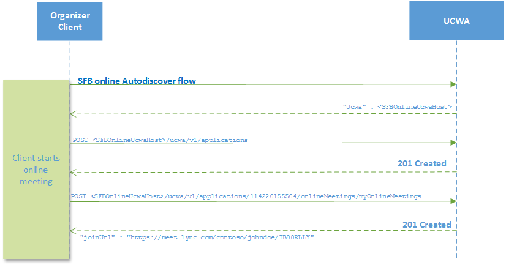
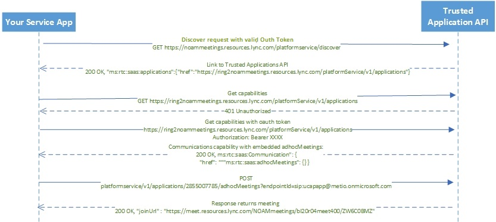

# Anonymous Meeting Scheduling

Here we will discuss a few ways to schedule an Anonymous meeting and get meeting url.

1.  [Schedule meeting via Skype for Business client](https://msdn.microsoft.com/en-us/skype/appsdk/getmeetingurl)

2.  Schedule meeting with UCWA
     
    Please read [Authentication using Azure AD](https://msdn.microsoft.com/en-us/skype/ucwa/authenticationusingazuread) for detailed Autodiscovery flow. Thereafter [myOnlineMeetings](https://msdn.microsoft.com/en-us/skype/ucwa/myonlinemeetings_ref) resource can be used to create a new online meeting as well as to modify and delete existing ones. 

    

3.  Schedule meeting with the **Trusted Application API**
       > Note: Please read [Developing **Trusted Application API** applications for Skype for Business Online
](./DevelopingApplicationsforSFBOnline.md) for detailed workflow.

    1. **Discovery**
        - Discover request - Your Service Application also known as SaaS application(SA) discovers the location of the **Trusted Application API**.**This GET request must be authenticated with a valid OAuth token.**
         Please refer [Azure Active Directory - Service to Service calls using Client Credentials](./AADS2S.md) for more information on how to get a OAuth Token.
   
        ```
        GET https://api.skypeforbusiness.com/platformservice/discover
        ```
            
        - Discovery Response - returns the link to the Trusted Applications API.
        ```
        200 OK, "service:applications":{"href":"https://api.skypeforbusiness.com/platformService/v1/applications"}
        ```
    2. **Get the capabilities**
       
        - We send a GET request with Trusted Applications API link received from the previous discovery Request. **This GET request must be authenticated with a valid OAuth token.** Please refer [Azure Active Directory - Service to Service calls using Client Credentials](./AADS2S.md) for more information on how to get OAuth Token.
                
        ```
        //Capabilities request without valid Oauth token gets '401 Unauthorized' response

        GET https://api.skypeforbusiness.com/platformService/v1/applications

        //Capabilities request with valid Oauth token

        GET https://api.skypeforbusiness.com/platformService/v1/applications
        Authorization: Bearer XXXX

        //Capabilities Response - Communication capability with embedded adhocMeetings.

        200 OK,service:Communication":{"href":"service:adhocMeetings":{}}
        ```
   3. **POST request to get meeting URL** 

        ```
        POST platformService/v1/applications/2855007785/adhocMeetings?endpointId=sip:ucapapp@metio.onmicrosoft.com

        //Response - returns meeting url

        200 OK, "joinURL": "https://meet.resources.lync.com/NOAMmeetings/bI2OrO4meet400/ZW6COBMZ"
        ```



