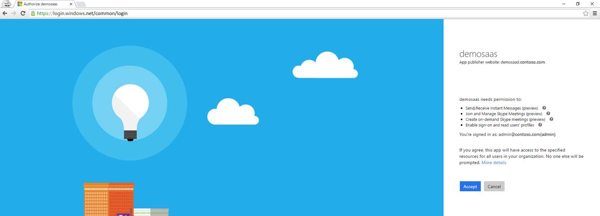

# Tenant Admin Consent

A service application is registered in Azure Active Directory in the context of a tenant. Before a trusted application can be used in that tenant or any other tenant, tenant consent is needed. 
For service applications developed for a single or multi-tenant scenario, service application permission requests must be consented to by the tenant's admin.
 
In order for a tenant to consent to the application, the following is required:
 
- Construct a consent link with the client id and redirect uri of the Service Application set correctly
 
   For example: 
```https
    https://login.windows.net/common/oauth2/authorize?response_type=id_token&client_id=727c43e2-08ea-4794-80f8-069bbbebb755&redirect_uri=http://trusteddemo.contoso.com&response_mode=form_post&nonce=a4014117-28aa-47ec-abfb-f377be1d3cf5&resource=https://noammeetings.resources.lync.com&prompt=admin_consent
``` 

This opens up a page after the tenant admin logs in. It lists the permissions the Service Application has asked for the tenant admin to consent. Once accepted the Service Application can get oauth tokens from AAD, for that tenant.
 
You can read more about [Building service apps in Office 365](https://msdn.microsoft.com/en-us/office/office365/howto/building-service-apps-in-office-365) to get a more complete understanding of Office 365 service applications.

 

 
## Revoking tenant admin consent
 
Consent to service applications can be revoked just like for other applications that are installed by a tenant administrator of the Office 365 organization. The administrator can either go to the AAD Azure Management Portal, find the application in the application view, select and delete it, or alternatively the administrator can use Azure AD PowerShell to remove the app via the "Remove-MSOLServicePrincipal" cmdlet.
 

```PowerShell 
PS C:\windows\system32> Get-MsolServicePrincipal
 
    ExtensionData         : System.Runtime.Serialization.ExtensionDataObject
    AccountEnabled        : True
    Addresses             : {Microsoft.Online.Administration.RedirectUri}
    AppPrincipalId        : 727c43e2-08ea-4794-80f8-069bbbebb755
    DisplayName           : demosaas
    ObjectId              : 6291d162-f57f-44f8-8022-d8e17cbca62a
    ServicePrincipalNames : {http://demosaad.contoso.com, 727c43e2-08ea-4794-80f8-069bbbebb755}
    TrustedForDelegation  : False

 Remove-MsolServicePrincipal -ObjectId 6291d162-f57f-44f8-8022-d8e17cbca62a
 
```  
