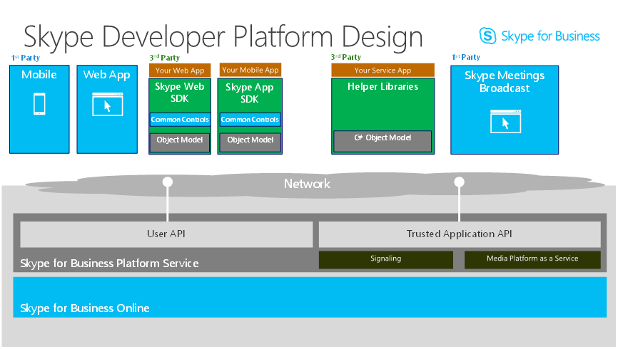

# Enabling communications services for the cloud

>Note: The Trusted Application API is in Developer Preview and not licensed for production usage.  As part of Microsoft’s [intellgent communications vision](https://aka.ms/intelligentcommunicationsblog), we’re building extensible communications capabilities into Teams.  For more Teams Developer information, check out [https://aka.ms/TeamsDeveloper](https://aka.ms/TeamsDeveloper)

The **Trusted Application API** is our vision of an extensible Skype for Business Online Cloud that meets your demand for powerful, back-end features.  The API aims to provide developer opportunities similar to Skype for Business Server's Unified Communications Managed API (UCMA)...in the cloud. The API enables a cloud-first approach and additional powerful features that aren't available to on-premises Skype for Business Server customers through UCMA.

Built on the Skype for Business Online Platform, the **Trusted Application API** lets a developer build immersive, smart, and interactive communication experiences and trusted services.

## Evolution from on-premise server API to online service API

The **Trusted Application API** marks an evolution of the on-premises Unified Communications Managed API (UCMA) middle tier platform to a normalized and service-oriented architecture. Fundamentally, the core Platform Service that exposes the **Trusted Application API** shares the same compute and storage resources across multiple applications, tenants, and domains. It helps reduce operational costs and makes scaling easier as demand grows. At the same time, it guarantees to its service consumers and end users that communication resources and tenant/domain-specific application data are properly isolated to mitigate any security risks that would stem from untrusted tenants and applications.
 
## Authentication and security

The Skype for Business Online Platform Service exposes Trusted Application RESTful APIs that require both:
 
- Domain-level authorization by System or Tenant Administrators to be exercised,
- Service-to-service authentication of the Service Application that invokes them.
 
For security and billing reasons, granting an application the permissions to access such APIs is a prerogative of Tenant Administrators rather than end-users.  Once a Tenant Admin gives consent to use an Application (which may have implications on usage and billing) they may manage it to the extent of permissions that are usually bound to the domain (or a subset) they administer.

The **Trusted Application API** allows you to write SFB Online applications that act as a service endpoint and do not require a user context or identity.  The most common scenarios are applications that schedule or manage on-demand meetings like a contact center type application, that can create on demand meetings to handle customer calls and add customer service representatives to the meeting, voice based call answering and routing bots.

## Trusted Application architecture

The following diagram shows how the **Trusted Application API** is positioned as a middle tier Software as a Service component in Skype for Business Online. A 3rd party Service App can
add value to an enterprise Skype for Business solution by providing a simple RESTful interface between a mobile client and the Trusted Application endpoint. For example, a Service App helper
method can handle authentication token fetching and discovery services for a mobile client. It can call **Trusted Application API**s to create new meetings and then return meeting join Urls to 
mobile clients that will join the meetings.

## Example solutions

Attendant console, Customer engagement / Contact Center, Recording, Compliance, Bots, Meeting Management, Click-to-chat, Click-to-call, and Value Add solutions
 
Other such applications include but are not limited to:
 
- Bots and Notifications,
- Anonymous Customer Web Chat,
- PSTN audio conferencing (IVR to join the conference, in-meeting Personal Virtual Assistant, and in-meeting announcements),
- Service-side meeting recording, 
- Inbound/outbound IVRs,
- Helpdesk,
- Expert-finder,
- Contact center,

 
For illustration purposes, the **Trusted Application API** may also be used for the following high-privilege scenarios:
 
- Back-to-backing calls to conceal the identities of customer service representative in a B2C call
- Invisibly monitor an online meeting and its roster while having full control over the actions that can be taken in the conference including managing real-time media routes for silent monitoring, coaching scenarios and broadcasting in a conference,
- Pop or insert calls in a call pit,
- Use large amounts of computation-intensive real time resources for Voice/Video playback, recording, or speech synthesis or recognition
 
 

## In this section

- [Key scenarios](./keyscenarios.md)
- [Key programming concepts](./NewConcepts.md)
- [Definition of key terms](./KeyTerms.md)
- [Application permissions](./Application_Permissions.md)

## Additional Background for Developers
 
Prior knowledge and understanding of the following APIs from the Skype Developer Platform greatly simplifies understanding of the **Trusted Application API**.
 
- [The Unified Communications Web API (UCWA)](https://ucwa.skype.com)
 
  The **Trusted Application API** and Unified Communications Web API (UCWA) are a part of a single code base and RESTful programming model.  Although separate namespaces, the APIs together form the Skype for Business Platform Service layer, providing user endpoint and application endpoint functionality to Skype for Business Online.  Concepts from UCWA that also apply to the **Trusted Application API**:
 
  HTTP, Hypermedia, Resources, Payload Format, Query Parameters, Operation Resource, Caching, Batch, and Errors. - [Key programming concepts](https://ucwa.skype.com/documentation/key-programming-concepts)
 
  The general principles, capabilities, API style, API concepts in the **Trusted Application API** are modelled to follow those in the UCWA.  Please see this link for detailed UCWA info - [UCWA API reference](https://msdn.microsoft.com/en-us/skype/ucwa/ucwa2_0apireference)
 
 
- [The Unified Communications Managed API (UCMA)](https://msdn.microsoft.com/en-us/library/office/dn454984.aspx)
 
  UCMA is a C# API that includes development and runtime components for Skype for Business Server.  Like the **Trusted Application API**, UCMA makes it easy for developers to develop powerful communication solutions.  Knowledge of UCMA is helpful for understanding similar communications scenarios in the **Trusted Application API**:  Sophisticated contact center or help desk scenarios, such as those that use interactive voice response (IVR), automated call distribution (ACD), and call-recording. Other scenarios include web chat, query response bots, and conferencing.
 
  The **Trusted Application API** does not provide feature parity with UCMA and does not provide the ability to directly port on-premises UCMA applications to the cloud.  Although designed to enable similar business scenarios, unlike UCMA, the **Trusted Application API** is designed with modern web service development principles and a RESTful, services-based architecture.
 
 
