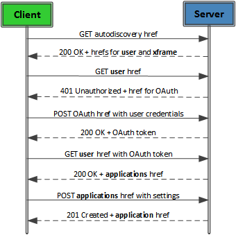

# Create an application
Learn the steps that must be performed to produce an **application** resource.


 _**Applies to:** Skype for Business 2015_

Let's walk through the steps of creating an application. These steps include discovering a user's home server, authenticating the user, and creating the application. Discovery is the act of finding a home server, while authentication is the act of proving who you are to the Skype for Business Server.

After the discovery and authentication processes, the application is registered with the UCWA 2.0 server.The illustration shows the sequence of HTTP requests and responses between the client and the UCWA 2.0 server.

**HTTP call flow prior to creating an application in UCWA**




1. Send a GET request on the Autodiscovery URL. 
 
 The Autodiscovery URL can be constructed by appending the domain name to the string "https://lyncdiscover". For example, if the domain name is "contoso.com", the Autodiscovery URL would be "https://lyncdiscover.contoso.com/". 
 
    ```
    GET https://lyncdiscover.contoso.com/ HTTP/1.1
    X-Ms-Origin: http://app.fabrikam.com
    Accept: application/json
    X-Requested-With: XMLHttpRequest
    Referer: https://lyncdiscover.contoso.com/xframe
    Accept-Language: en-us
    Accept-Encoding: gzip, deflate
    User-Agent: Mozilla/5.0 (compatible; MSIE 9.0; Windows NT 6.1; WOW64; Trident/5.0)
    Host: lyncdiscover.contoso.com
    Connection: Keep-Alive
    ```

2. Process the response from the previous request.
 
 The response from the previous GET request should be 200 OK. The body of the response contains three links. Each link is a key-value pair that consists of a name ("rel") and an object. The object is also a key-value pair in which the key is "href" and the value is the URL. 
 
 - self (the current resource)
 
 - [user](user_ref.md) (the user on whose behalf you are logging in)
 
 - [xframe](xframe_ref.md) (the cross-domain frame used for web-based applications. )
 
   The user and xframe URLs will be used later, so it is important that you cache them.
 ```
        HTTP/1.1 200 OK
        Connection: Keep-Alive
        Content-Length: 321
        Expires: -1
        Date: Sat, 12 Jan 2013 01:00:37 GMT
        Content-Type: application/json
        Server: Microsoft-IIS/7.5
        Cache-Control: no-cache
        Pragma: no-cache
        X-AspNet-Version: 4.0.30319
        X-MS-Server-Fqdn: W15-LYNC-SE1.contoso.com
        X-Powered-By: ASP.NET
        X-Content-Type-Options: nosniff

        {
        "_links":{
        "self":{"href":"https://lyncweb.contoso.com/Autodiscover/AutodiscoverService.svc/root?originalDomain=contoso.com"},
        "user":{"href":"https://lyncweb.contoso.com/Autodiscover/AutodiscoverService.svc/root/oauth/user?originalDomain=contoso.com"},
        "xframe":{"href":"https://lyncweb.contoso.com/Autodiscover/XFrame/XFrame.html"}
        }
        }
```

3. Send a GET request on the user URL, indicating that we want to authenticate as a user.
 
 The URL in this GET request comes from the response body of the previous GET request. The **user** href is used for the URL in the request, and the **xframe** href is used in the Referer header of this request. Notice also that the Host header changes from lyncdiscover.contoso.com to lyncweb.contoso.com.
 
 ```
 GET https://lyncweb.contoso.com/Autodiscover/AutodiscoverService.svc/root/oauth/user?originalDomain=contoso.com HTTP/1.1
X-Ms-Origin: http://app.fabrikam.com
Accept: application/json
X-Requested-With: XMLHttpRequest
Referer: https://lyncweb.contoso.com/Autodiscover/XFrame/XFrame.html
Accept-Language: en-us
Accept-Encoding: gzip, deflate
User-Agent: Mozilla/5.0 (compatible; MSIE 9.0; Windows NT 6.1; WOW64; Trident/5.0)
Host: lyncweb.contoso.com
Connection: Keep-Alive

 ```

4. Process the response from the previous request.
 
 The response from the previous GET request should be 401 Unauthorized. This should be no surprise, as the user is not yet authenticated. The body of the response contains a URL that can be used to get an OAuth token that is used in all subsequent requests. 
 
    ```
    HTTP/1.1 401 Unauthorized
    Connection: Keep-Alive
    Content-Length: 1293
    Date: Sat, 12 Jan 2013 01:00:47 GMT
    Content-Type: text/html
    Server: Microsoft-IIS/7.5
    WWW-Authenticate: Bearer trusted_issuers="00000002-0000-0ff1-ce00-000000000000@contoso.com", client_id="00000004-0000-0ff1-ce00-000000000000"
    WWW-Authenticate: MsRtcOAuth href="https://lyncweb.contoso.com/WebTicket/oauthtoken",grant_type="urn:microsoft.rtc:windows,urn:microsoft.rtc:anonmeeting,password"
    X-MS-Server-Fqdn: W15-LYNC-SE1.contoso.com
    X-Powered-By: ASP.NET
    X-Content-Type-Options: nosniff
    Vary: Accept-Encoding

    ```
The response body contains an HTML document (not shown here) with the following text:
 
 > Server Error401 - Unauthorized: Access is denied due to invalid credentials. You do not have permission to view this directory or page using the credentials that you supplied.

5. Send a POST request on the OAuth URL.
 
 UCWA 2.0 supports three authentication mechanisms:
 
 - Windows authentication - allow the browser to launch a Windows prompt that gets user credentials from the operating system.
 
 - Anonymous meeting - allow an anonymous user to participate in an online meeting.
 
 - Password authentication - collect the user's credentials in the code for your application.
 
 To use password authentication, you must provide a function that gets a user's credentials. This can take the form of HTML ```<input>``` tags, a JavaScript input dialog box, or other means of getting input.
 
 The response shown here uses password authentication. To use Windows authentication, for example, place the following in the request body- grant_type=urn:microsoft.rtc:windows.
 
    ```
    POST https://lyncweb.contoso.com/webticket/oauthtoken HTTP/1.1
    Accept: application/json
    Content-Type: application/x-www-form-urlencoded;charset='utf-8'
    X-Ms-Origin: http://app.fabrikam.com
    X-Requested-With: XMLHttpRequest
    Referer: https://lyncweb.contoso.com/Autodiscover/XFrame/XFrame.html
    Accept-Language: en-us
    Accept-Encoding: gzip, deflate
    User-Agent: Mozilla/5.0 (compatible; MSIE 9.0; Windows NT 6.1; WOW64; Trident/5.0)
    Host: lyncweb.contoso.com
    Content-Length: 63
    Connection: Keep-Alive
    Cache-Control: no-cache

    grant_type=password&amp;username=lenea@contoso.com&amp;password=pass@word1

    ```

6. Process the response from the previous request.
 
 The response from the previous POST request should be 200 OK. The body of the response contains the OAuth token that must be used in all subsequent requests. 
 
 For the sake of brevity, the OAuth token is not shown in its entirety.
 
    ```
    HTTP/1.1 200 OK
    Connection: Keep-Alive
    Content-Length: 250
    Date: Sat, 12 Jan 2013 01:00:47 GMT
    Content-Type: application/json
    Server: Microsoft-IIS/7.5
    Cache-Control: no-store
    Pragma: no-cache
    X-AspNet-Version: 4.0.30319
    X-MS-Server-Fqdn: W15-LYNC-SE1.contoso.com
    X-Powered-By: ASP.NET
    X-Content-Type-Options: nosniff

    {
    "access_token":"cwt=AAEB...buHc",
    "expires_in":28289,
    "ms_rtc_identityscope":"local",
    "token_type":"Bearer"
    }

    ```

7. Send another GET request on the **user** resource, passing the OAuth token in the Authorization header of the request.
 
 The previous GET request on the user resource resulted in a response code of 401 Not Authorized, because the request was made without an OAuth token. 
 
    ```
    GET https://lyncweb.contoso.com/Autodiscover/AutodiscoverService.svc/root/oauth/user?originalDomain=contoso.com HTTP/1.1
    Authorization: Bearer cwt=AAEB...buHc
    Accept: application/json
    X-Ms-Origin: http://app.fabrikam.com
    X-Requested-With: XMLHttpRequest
    Referer: https://lyncweb.contoso.com/Autodiscover/XFrame/XFrame.html
    Accept-Language: en-us
    Accept-Encoding: gzip, deflate
    User-Agent: Mozilla/5.0 (compatible; MSIE 9.0; Windows NT 6.1; WOW64; Trident/5.0)
    Host: lyncweb.contoso.com
    Connection: Keep-Alive

    ```

8. Process the response from the previous GET request. 
 
 A successful response is 200 OK. The response body contains a link to the [applications](applications_ref.md) resource, which is used in the next step.
 
    ```
    HTTP/1.1 200 OK
    Connection: Keep-Alive
    Content-Length: 260
    Expires: -1
    Date: Fri, 15 Feb 2013 20:45:34 GMT
    Content-Type: application/json
    Server: Microsoft-IIS/7.5
    Cache-Control: no-cache
    Pragma: no-cache
    X-AspNet-Version: 4.0.30319
    X-MS-Server-Fqdn: W15-LYNC-SE1.contoso.com
    X-Powered-By: ASP.NET
    X-Content-Type-Options: nosniff

    {
    "_links":{
    "self":{"href":"https://lyncweb.contoso.com/Autodiscover/AutodiscoverService.svc/root/user"},
    "applications":{"href":"https://lyncweb.contoso.com/ucwa/oauth/v1/applications"},
    "xframe":{"href":"https://lyncweb.contoso.com/Autodiscover/XFrame/XFrame.html"}
    }
    }
    ```

9. Send a POST request on the **applications** resource.
 
 Now that you have user credentials, your request to access UCWA 2.0 as a user will be granted and you will receive a resource with a single link to the **applications** resource. Why do you care about the **applications** resource? This is how you register your application with UCWA 2.0 as an agent of the user whose credentials you obtained in a previous step.
 
 The 's' at the end of applications indicates that it represents a collection of individual [application](application_ref.md) resources. In UCWA 2.0, the convention to create or add an item to a collection is to perform a POST request on the collection. To do that, we look at the reference documentation for the **applications** resource and see that it takes three input parameters, which are shown in the body of the following request.
 
    ```
    POST https://lyncweb.contoso.com/ucwa/oauth/v1/applications HTTP/1.1
    Accept: application/json
    Content-Type: application/json
    Authorization: Bearer cwt=AAEB...buHc
    X-Ms-Origin: http://app.fabrikam.com
    X-Requested-With: XMLHttpRequest
    Referer: https://lyncweb.contoso.com/Autodiscover/XFrame/XFrame.html
    Accept-Language: en-us
    Accept-Encoding: gzip, deflate
    User-Agent: Mozilla/5.0 (compatible; MSIE 9.0; Windows NT 6.1; WOW64; Trident/5.0)
    Host: lyncweb.contoso.com
    Content-Length: 117
    Connection: Keep-Alive
    Cache-Control: no-cache

    {
    "UserAgent":"UCWA Samples",
    "EndpointId":"a917c6f4-976c-4cf3-847d-cdfffa28ccdf",
    "Culture":"en-US",
    }

    ```

10. Process the response from the previous request. 
 
 The response from the previous POST request should be 201 Created, which indicates that your application is now registered with the UCWA 2.0 server. The body of the response contains the application resource, which contains basic information about the application, links to related resources such as the [batch](batch_ref.md) and [events](events_ref.md) resources, and four resources that are so useful that they are embedded in the application resource - [me](me_ref.md), [people](people_ref.md), [onlineMeetings](onlineMeetings_ref.md), and [communication](communication_ref.md). 
 
    ```
    HTTP/1.1 201 Created
    Connection: Keep-Alive
    Content-Length: 3488
    Date: Sat, 12 Jan 2013 01:00:47 GMT
    Content-Type: application/json; charset=utf-8
    Server: Microsoft-IIS/7.5
    Cache-Control: no-cache
    P3P: CP="IDC CUR ADMa OUR BUS"
    X-AspNet-Version: 4.0.30319
    Set-Cookie: cwt_ucwa=AAEB...G9z; path=/ucwa/oauth/v1/applications/104082042405/photos; secure; 

    HttpOnly
    X-MS-Server-Fqdn: W15-LYNC-SE1.contoso.com
    X-Powered-By: ASP.NET
    {
    "culture":"en-US",
    "userAgent":"UCWA Samples",
    "_links":{
    "self":{"href":"/ucwa/oauth/v1/applications/105"},
    "policies":{"href":"/ucwa/oauth/v1/applications/105/policies"},
    "batch":{"href":"/ucwa/oauth/v1/applications/105/batch"},
    "events":{"href":"/ucwa/oauth/v1/applications/105/events?ack=1"}
    },
    "_embedded":{
    "me":{
    "name":"Lene Aaling",
    "uri":"sip:lenea@contoso.com",
    "_links":{
    "self":{"href":"/ucwa/oauth/v1/applications/105/me"},
    "makeMeAvailable":{"href":"/ucwa/oauth/v1/applications/105/me/makeMeAvailable"},
    "callForwardingSettings":{"href":"/ucwa/oauth/v1/applications/105/me/callForwardingSettings"},
    "phones":{"href":"/ucwa/oauth/v1/applications/105/me/phones"},
    "photo":{"href":"/ucwa/oauth/v1/applications/105/photos/lenea@contoso.com"}
    },
    "rel":"me"
    },
    "people":{
    "_links":{
    "self":{"href":"/ucwa/oauth/v1/applications/105/people"},
    "presenceSubscriptions":{"href":"/ucwa/oauth/v1/applications/105/people/presenceSubscriptions"},
    "subscribedContacts":{"href":"/ucwa/oauth/v1/applications/105/people/subscribedContacts"},
    "presenceSubscriptionMemberships":{"href":"/ucwa/oauth/v1/applications/105/people/presenceSubscriptionMemberships"},
    "myGroups":{"href":"/ucwa/oauth/v1/applications/105/people/groups"},
    "myGroupMemberships":{"href":"/ucwa/oauth/v1/applications/105/people/groupMemberships"},
    "myContacts":{"href":"/ucwa/oauth/v1/applications/105/people/contacts"},
    "myPrivacyRelationships":{"href":"/ucwa/oauth/v1/applications/105/people/privacyRelationships"},
    "myContactsAndGroupsSubscription":{"href":"/ucwa/oauth/v1/applications/105/people/contactsAndGroupsSubscription"},
    "search":{"href":"/ucwa/oauth/v1/applications/105/people/search"}
    },
    "rel":"people"
    },
    "onlineMeetings":{
    "_links":{
    "self":{"href":"/ucwa/oauth/v1/applications/105/onlineMeetings"},
    "myOnlineMeetings":{"href":"/ucwa/oauth/v1/applications/105/onlineMeetings/myOnlineMeetings"},
    "onlineMeetingDefaultValues":{"href":"/ucwa/oauth/v1/applications/105/onlineMeetings/defaultValues"},
    "onlineMeetingEligibleValues":{"href":"/ucwa/oauth/v1/applications/105/onlineMeetings/eligibleValues"},
    "onlineMeetingInvitationCustomization":{"href":"/ucwa/oauth/v1/applications/105/onlineMeetings/customInvitation"},
    "onlineMeetingPolicies":{"href":"/ucwa/oauth/v1/applications/105/onlineMeetings/policies"},
    "phoneDialInInformation":{"href":"/ucwa/oauth/v1/applications/105/onlineMeetings/phoneDialInInformation"},
    "myAssignedOnlineMeeting":{"href":"/ucwa/oauth/v1/applications/105/onlineMeetings/myOnlineMeetings/1XAW22CG"}
    },
    "rel":"onlineMeetings"
    },
    "communication":{
    "4d221db7-4af0-476b-9443-8bc874283085":"please pass this in a PUT request",
    "supportedModalities": [],
    "supportedMessageFormats": ["Plain"],
    "_links":{
    "self":{"href":"/ucwa/oauth/v1/applications/105/communication"},
    "conversations":{"href":"/ucwa/oauth/v1/applications/105/communication/conversations?filter=active"},
    "startMessaging":{"href":"/ucwa/oauth/v1/applications/105/communication/messagingInvitations"},
    "startOnlineMeeting":{"href":"/ucwa/oauth/v1/applications/105/communication/onlineMeetingInvitations?onlineMeetingUri=adhoc"},
    "joinOnlineMeeting":{"href":"/ucwa/oauth/v1/applications/105/communication/onlineMeetingInvitations"}
    },
    "rel":"communication",
    "etag":"3140562359"
    }
    },
    "rel":"application"
    }
    ```


## Next steps

Congratulations! The response to the final POST contains your very own UCWA 2.0 application, which is the starting point for every web application that works with UCWA 2.0. There are many things that you can do with your application. For some ideas, go to the UCWA 2.0 dashboard, and start communicating!

