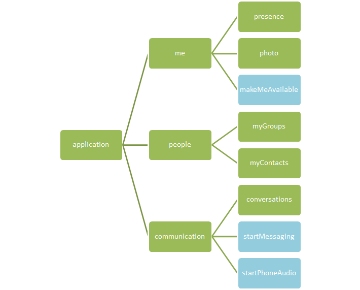

# Hypermedia
A Microsoft Unified Communications Web API 2.0 application uses hypermedia links to discover and dynamically navigate the features that are currently available. 

 _**Applies to:** Skype for Business 2015_

The Microsoft Unified Communications Web API 2.0 uses hypermedia links to discover and dynamically navigate the features that are available at any given time. The client application starts with application creation and is presented with the features that are available in the returned [application](application_ref.md) resource. As the client fetches more and more resources, it can discover additional links. The absence of a link indicates that the client is not allowed to access that resource either due to current state, policies, or other reasons. Hypermedia links provide a powerful mechanism for the UCWA 2.0 API to drive capabilities of the client dynamically at run time. Client applications are expected to take full advantage of this mechanism to drive the user experience even though the newness of this paradigm might require some time to become fully familiar with the concept.

The illustration that follows shows the first three levels of a tree view of the web of resources that comprise UCWA 2.0, and how the resources relate to each other. Each resource is rendered as a node and links between them are shown as edges.

**Resource hierarchy in UCWA**

A hypermedia link is just like the link elements present in HTML documents. The link element contains _rel_and _href_attributes to indicate the resource type and the URL of the resource. The client can store the link and fetch it as needed at some later time. These links are also useful to drive user interface elements affording users access only to the features available at that time. Driving the user interface based on available hypermedia links offers a better overall experience for users.
In addition to the **rel** and **href** attributes, some resources can add additional attributes such as **etag** or **title**. A client should ignore any attribute that it does not understand. For an example of one of these extra attributes, consider that a participant link might include the participant's title, which makes it possible for the user interface to show the participant's display name without fetching the full resource.

## URL usage

The client should determine whether a hypermedia link is relative or absolute, and use it accordingly. A relative URL is relative to the host portion of the main UCWA 2.0 URL. Clients can cache these URLs in the context of a given session but they should not be used across different sign-on sessions. In other words, if the client creates the application again, the URLs for the same resources will probably be different, as they are generated by the server, and can change location. 

Some resources or operations can support certain query parameters that are passed by the client. The client should avoid string manipulation to add query parameter, because this can lead to potential errors (double question marks, for example). The recommended way to add query parameters is to use a proper URL parser. Note that some URLs in the links might already have query parameters that were added by the server. It is important for the client to preserve these server-added query parameters without changing their values.

## Capability links

Some links are temporary and reflect the capabilities that the user has at a particular moment in time. For example, when a meeting attendee is in the lobby, an admit capability will appear. After the user is admitted, the admit link will no longer appear.

