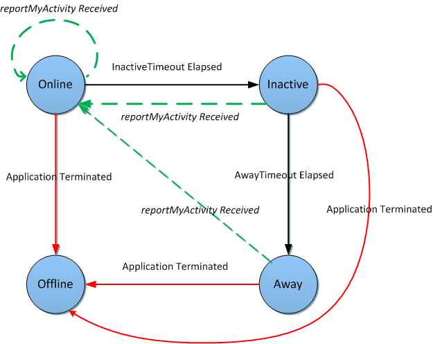

# Me dashboard
The **me** resource acts as a dashboard that represents the user of a Microsoft Unified Communications Web API 2.0 application.


 _**Applies to:** Skype for Business 2015_

The [me](me_ref.md) resource contains data that pertains to a user of a UCWA 2.0 application.

## Resource representation
<a name="sectionSection0"> </a>

The following table contains a representation of the **me** resource.


**Property bag**
```
"rel" : "me",
"department" : "Sales",
"emailAddresses" :{
 johndoe@contoso.com}
 "name": "John Doe",
 "title": "Assistant Manager",
 "uri": "sip:johndoe@contoso.com"
}

```

**Links**
```
"self" : {
 "href" : "/ucwa/v1/applications/105/me"
},
"makeMeAvailable" : {
 "href" : "/ucwa/v1/applications/105/communication/makeMeAvailable"
},
"reportMyActivity" : {
 "href" : "/ucwa/v1/applications/105/reportMyActivity"
},
"photo" : {
 "href" : "/ucwa/v1/applications/105/photo"
},
"phones" : {
 "href" : "/ucwa/v1/applications/105/me/phones"
},
"location" : {
 "href" : "/ucwa/v1/applications/105/me/location"
},
"presence" : {
 "href" : "/ucwa/v1/applications/105/me/presence"
},
"note" : {
 "href" : "/ucwa/v1/applications/105/me/note"
},
"callForwardingSettings" : {
 "href" : "/ucwa/v1/applications/105/me/callForwardingSettings"
}

```


All of the preceding links other than [presence](presence_ref.md), [note](note_ref.md), and [location](location_ref.md) are available on application creation. These three are unavailable because the user is not available to communicate and is therefore not sharing this information with others yet. To get the user's current presence, location and note, the application should indicate availability for incoming communications by invoking [makeMeAvailable](makeMeAvailable_ref.md). If an application is created with anonymous credentials, only the user's URI and name are exposed.

By invoking the **makeMeAvailable** resource, the user indicates her availability for communication from the application, and also indicates the modalities supported for incoming calls.

Upon a successful response, the **presence**, **note**, and **location** resources are available for use and real time events will indicate changes to these resources. Changes to other resources such as [photo](photo_ref.md), [phones](phones_ref.md), or [callForwardingSettings](callForwardingSettings_ref.md) are not communicated, since they rarely change.

There is Etag support for these resources so that the application can determine if data has changed, as described later in this page.


## Reporting activity
<a name="sectionSection1"> </a>

After the user signs in to the application, the client application can monitor how actively the user is using it via mouse movements, keyboard entries or other input modalities, and report this to the server by invoking the [reportMyActivity](reportMyActivity_ref.md) resource. This allows the server to automatically modify the presence of the user so that presence is reflected accurately.

For example, if no activity is reported for a certain period (specifically inactiveTimeout), the server changes the user's availability to Idle. If no further activity is reported for another elapsed duration (called awayTimeout), the availability of the user changes to Away. The following diagram illustrates this concept.


**How user activity or inactivity influences application lifetime**



>Note: Availability in this case is only the availability of the user from the current application, and not overall availability. The user could be active on another application.

If the application is unused (no use of **reportMyActivity**) and the user is not participating in calls, the application is terminated on the server. Additionally, if the server does not receive a new event channel request 15 minutes after the previous request was released, it assumes the client has lost connectivity and terminates the application.


## photo
<a name="sectionSection2"> </a>

A [photo](photo_ref.md) link allows the application to fetch the user's photo. The link will be served whether or not the application owner has a photo configured in Exchange Server.

Applications can indicate the preferred size of the photo by including it as a query parameter when making the request. If a photo of that size is not present, a photo with a lower resolution is returned. The photos are compressed JPEG, and the sizes can vary from 2 Kb to 100 Kb. If the application is not written for browsers, then client application authors are advised to build a cache management framework to optimize photo fetch and download.

UCWA 2.0 provides the following two headers for cache validation:


1. Etag: can be used to decide if the content of the photo resource has changed. Subsequent fetches can include the value of this header in the 'If-None-Match' header of the request. If the photo is unchanged, a response code of 304 Not Modified is returned by the server.
 
2. Expires: indicates for how long this resource can be considered current, so that the application need not attempt to fetch the photo until the time is elapsed. If the photo is displayed in a page and the fetch is controlled by the browser, then a page refresh can result in a photo request and this header might help to tell the browser to avoid sending an unneeded request.
 
UCWA 2.0 will not serve a photo link without some sort of authorization. The security token, discussed in [Authentication in UCWA](AuthenticationInUCWA.md), is the typical choice for UCWA 2.0 requests. However, a browser-based application may render the image by embedding it in the DOM; since browsers cannot add headers to such requests, the server offers a cookie-based mechanism. The cookie has an expiration time that is closely tied to the expiration of the token. Because of this, the application that refreshes the token is responsible for ensuring that the cookie is fresh as well, so the browser fetch will continue to work. An existing application should perform a get on the [application](application_ref.md) resource to refresh the cookie, while a new application receives its cookie upon application creation (POST to [applications](applications_ref.md)).


## phones
<a name="sectionSection3"> </a>

The [phones](phones_ref.md) resource contains all the phone numbers configured for the user. The user can share these numbers with other contacts. Currently the API supports one phone number in each of the following categories: work, mobile, home, and other. A user can modify a phone number via UCWA 2.0 based on the presence of the [changeNumber](changeNumber_ref.md) resource. If any of the phone types is configured in Active Directory Domain Services (AD DS), it can only be modified by the system administrator, not from UCWA 2.0. The absence of the **changeNumber** link will indicate this.


## location
<a name="sectionSection4"> </a>

An application can use a [location](location_ref.md) resource to retrieve and display the current location of a user in plain text. Note that the user may be logged in from different applications. The location property exposed in the **me** resource represents the location of the most active endpoint of the user.


## presence
<a name="sectionSection5"> </a>

A [presence](presence_ref.md) resource indicates the availability of the user for communications and is an aggregation of her status from all of the applications that the user is signed in to. A user's presence contains two properties, availability and activity.

Availability indicates how ready the user is for communication and includes the following values: Online, Busy, Inactive, DoNotDisturb, Away, or Offline. 

Activity indicates how the user is occupied. Examples include in-a-meeting, urgent-interruptions-only, in-a-call, presenting, in-a-conference and off-work. Activity can be well known tokens that can be localized by the application for all languages that it supports. Activity can also be a custom token set by other clients such as the Microsoft Lync desktop client. 

At present UCWA 2.0 supports display of custom tokens, but not publishing. A custom presence includes culture information to allow the client to compare the user's preferred culture and choose the appropriate custom presence. The client application can try to localize the activity token upon receiving it and will show it without any changes if it cannot localize. 

It is possible for the user to change availability. Notifications will be sent to all applications the user is logged in on, and also to other contacts who are subscribed to the user's presence. 


## note
<a name="sectionSection6"> </a>

A [note](note_ref.md) resource represents a short message that the user can set for other people to read. They can be personal messages such as 'Such a pleasant day!' or 'Go Team!', or a professional Out Of Office message that is usually set on Exchange Server. The type of the note indicates the intent so they can be rendered accordingly. While UCWA 2.0 allows for viewing of both note types, it can be used to set personal notes only.


## Setting call forwarding rules
<a name="sectionSection7"> </a>

Voice call routing rules can be set by the use of the [callForwardingSettings](callForwardingSettings_ref.md) resource, for users who are enabled for enterprise voice. When a user is enabled they are provided with a primary number where they can be reached.

Typically one of the following modes is set:


- Do not forward any calls. Any incoming calls will ring the primary number for a certain configurable duration before being forwarded to voicemail, if voicemail is configured.
 
- Forward any incoming calls to another number, person, voicemail, or delegates without ringing the primary number.
 
- Simultaneously ring another number, person, delegates, or team members in addition to the primary number.
 
A user can choose whether these settings apply only during work hours, or all the time. The actual work hours must be set in Exchange Server via Microsoft Outlook or Outlook Web Access.The user can also choose how to handle unanswered calls, either unanswered directly by the user or by another target such as delegate, team member, or secondary number. This setting is indicated by the [unansweredCallSettings](unansweredCallSettings_ref.md) resource.

Many of the routing capabilities are governed by administrative policies and so there might be some links missing, indicating a lack of this capability because of enforcement of one of these policies. For example, the administrator might have disabled delegation, in which case the application will not see a link to forward calls to or simultaneously ring delegates.

