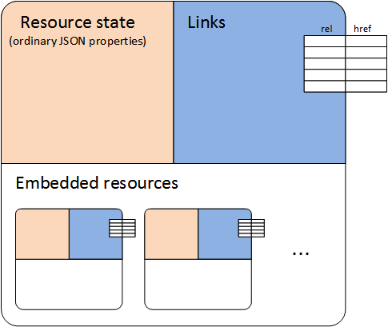

# Resources in UCWA
Resources are the API in Microsoft Unified Communications Web API 2.0. 


 _**Applies to:** Skype for Business 2015_

UCWA 2.0 exposes various Skype for Business-specific features to the client using what are known as _resources_. A resource can contain:


- information about the state of the resource, in the form of a property bag
 
- an array of web links to related resources
 
- embedded resources
 
The properties of a resource are simple string properties that can be represented in a JSON format.
If a resource references another resource, this reference can appear either as a link or as an embedded resource.

A resource represents an atomic unit that is generally not broken up in any protocol data.

**The components of a resource: property bag, links, and embedded resources**




The following is an abbreviated representation of the [application](application_ref.md) resource.

**Property bag**
```
"rel":"application",
"culture":"en-US",
"userAgent":"MyApp"
```


**Links**
```
"self" : {"href" : "/ucwa/v1/applications/764"},
"batch" : {"href" : "/ucwa/v1/applications/764/batch"},
"events" : {"href" : "/ucwa/v1/applications/764/events"},
"policies" : {"href" : "/ucwa/v1/applications/764/policies"}
```


**Embedded resources**
```
"communication" : { ... },
"me" : { ... },
"onlineMeetings" : { ... },
"people" : { ... }
```


>Note: A resource can change when other related resources and capabilities become dynamically available. Such changes are communicated by means of an event channel as described [Event channel details](EventChannelDetails.md) in this documentation. When the client learns that a resource has been updated, it can reacquire the resource to learn about the new capabilities and related resources.

## Rel attribute

Every link or resource representation in UCWA 2.0 includes a rel value, which can appear as an attribute in a link or as a property in a resource. The rel attribute is used to describe to the client how the link relates to the current resource. For example, if the server offers a [contactPhoto](contactPhoto_ref.md) link inside a [contact](contact_ref.md) resource, the client can use that link to fetch the photo resource that is associated with the contact. UCWA 2.0 uses a noun form for the rel value when the resource represents a concrete instance of a concept. Some examples are "application", "conversation", and "localParticipant". Other resources represent operations, and UCWA 2.0 represents these operations as verb forms to denote these operations. For example, the operation of starting a phone audio conversation is represented by a resource whose "rel" value is "startPhoneAudio".


## Collections of resources

Some resources that are defined in the API are collections of other resources. A [conversations](conversations_ref.md) resource is a collection of [conversation](conversation_ref.md) resources. A convention in this API is that, for collections that support it, a POST request to a collection is used to create a new resource that belongs to the collection. For example, to create a new myOnlineMeeting resource for a team meeting, send a POST request to the myOnlineMeetings resource.

