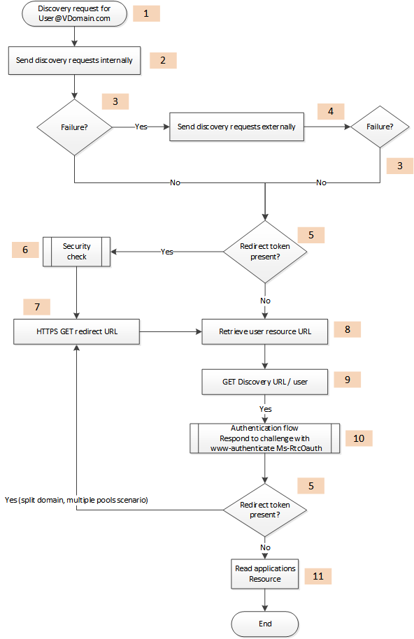
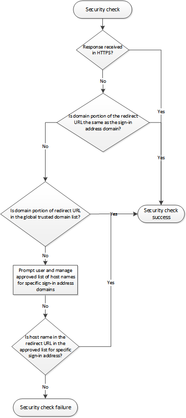

# Root URL
A UCWA 2.0 application's first task is to use the root URL to discover the URL of the user's home pool.


 _**Applies to:** Skype for Business 2015_

The first steps in creating a UCWA 2.0 application are _autodiscovery_and _authentication_.

A UCWA 2.0 application uses the root URL to discover the URL of the user's home pool. Autodiscovery is the act of finding the home server.
Authentication is the act of proving who you are to Skype for Business Server and UCWA 2.0. To access user-specific resources, a user must supply a correct set of credentials. To gain anonymous access to an online meeting, a user must supply the meeting ID. 
The _root URL_for UCWA 2.0 can take different forms, depending on which transport protocol is used (HTTP versus HTTPS) and on whether the application will run internally on the network or externally. Preference should always be given to the HTTPS form.
The different variations of the root URL are shown in the following table. 


|**Scheme**|**Internal**|**External**|
|:-----|:-----|:-----|
|HTTPS|https://LyncDiscoverInternal.<domain>|https://LyncDiscover.<domain>|
|HTTP|http://LyncDiscoverInternal.<domain>|http://LyncDiscover.<domain>|

## Discovery

A UCWA 2.0 application must not make any assumptions about where UCWA 2.0 is located. Skype for Business topologies are distributed and the server that will respond to a user's requests can run in different pools, depending on the scenario.

UCWA 2.0 always runs in the home pool of the authenticated user. For joining a meeting anonymously, or meeting applications that are not designed to receive incoming communications (such as a ), UCWA 2.0 always runs on the home pool of the meeting organizer. The purpose of the Autodiscovery flow that is described here is to find the location of UCWA 2.0. 

Autodiscovery is used by all Skype for Business client applications and is based on the protocol described in [ [MS-OCDISCWS]: Lync Autodiscover Web Service Protocol Specification](http://msdn.microsoft.com/en-us/library/hh623245%28v=office.12%29.aspx). The autodiscovery flow requires the deployment and configuration of the Skype for Business Server 2015 Autodiscover service. For more information, see [Autodiscover service requirements](http://technet.microsoft.com/en-us/library/hh690012%28v=ocs.15%29.aspx). 


 >Note: In coexistence mode (Lync 2010 and Skype for Business 2015), to support custom UCWA 2.0 application development, you must point the Autodiscover CNAME (Lyncdiscover.<domain> and LyncDiscoverinternal.<domain>) to a Skype for Business Server 2015 pool.


### Authenticated user flow

The illustration shows the steps that are involved in authenticating a user. The numbers in the illustration correspond to the items in the list that follows this illustration.

The steps shown here are recommended for a secure and generic autodiscovery flow for authenticated users. This flow addresses all possible on-premise topologies that customers are likely to encounter.

This flow should be executed for the first sign-in and succeeds when the client application retrieves the UCWA 2.0 URL. This URL can be cached until a failure occurs. A failure means that the application cannot communicate with UCWA 2.0 for the following reasons:


- HTTP 403 Client Forbidden
 
- HTTP 502 Bad Gateway
 
- Connection error after many retries
 
- Explicit sign out by the user
 
No other HTTP error codes require clearing the cache and starting the autodiscovery flow.


**The steps involved in autodiscovery and user authentication**



1. The user's sign-in address follows the SIP URI format: user@vdomain.com. This is the entry point of the autodiscovery flow.
 
2. An application can run on an internal network or an external network. The autodiscovery flow always gives priority to the internal network. The following requests can be executed in parallel, although it is highly recommended that only the HTTPS request be enabled.
 
  ```
  HTTPS GET LyncDiscoverInternal.<domain>
  HTTP GET LyncDiscoverInternal.<domain>

  ```

 Some scenarios can allow HTTP as a first hop. In such cases Lync will always respond with a redirect to HTTPS.
 
3. The response from these requests will fail if any of the following occurs:
 
 - No response, or a timeout occurs.
 
 - Connection error.
 
 - HTTP 302 redirect to a domain different from the domain of the autodiscovery service.
 
 - HTTP 404 response.
 
4. If internal requests do not succeed, try the external requests.
 
 ```
 HTTP GET LyncDiscover.<domain> 
HTTPS GET LyncDiscover.<domain>
 ```

5. For some online scenarios, the Skype for Business Autodiscover service might return a 200 OK response with a "redirect" link in the body. The client should validate the response before following the redirect link. 
 
  >Note: If you have a pure Skype for Business Server 2015 topology, the redirect scenario will not occur. A redirect can occur in hybrid topologies (On-Premises to Online). The current version, UCWA 2.0, does not support online scenarios.

  The following is an example redirect response.
 
  ```
  HTTP/1.1 200 OK 
  Content-Type: application/json
 {
  "_links":{
  "redirect":{
  "href":"https://contoso.com/Autodiscover/AutodiscoverService.svc/root"
  }
  }
 }
 ```

6. The security check step consists of making sure that the client is not spoofed. A detailed illustration follows this list.
 
7. The client can follow the redirect link.
 
8. The response from Autodiscover is a response with a link to the [user](user_ref.md) and [xframe](xframe_ref.md) resources.
 
  ```
  {
  "_links":{
  "self":{
  "href":"https://contoso.com/Autodiscover/AutodiscoverService.svc/root"
  },
  "user":{
  "href":"https://contoso.com/Autodiscover/AutodiscoverService.svc/root/oauth/user"
  },
  "xframe":{
  "href":"https://contoso.com/Autodiscover/XFrame/XFrame.html"
  }
  }
 }
 ```

9. The client must follow the link in the **user** resource.
 
10. The user resource is protected; hence the server replies with a challenge. For more information, see [Authentication in UCWA](AuthenticationInUCWA.md).
 
11. The final response contains a link to the [applications](applications_ref.md) resource. This is the link that is used to create the application.
 
### Security check

The flow shown here represents the security check that is mentioned in step 6 of the preceding authentication flow.


**Steps performed during a security check during user authentication**




### Anonymous meeting join flow

The flow in an anonymous meeting join is similar to the flow for an authenticated user. The most important difference is that the application should have the URI of the online meeting before starting the flow. The Skype for Business Conference URI format is as follows.


```
<Organizer SIP URI >; gruu;opaque=app:conf:focus:id:<Conference ID >
```

Instead of the user's URI that is used in step 1 of the authenticated user flow, for anonymous meeting join, the URI should be the organizer's SIP URI.

Applications that use anonymous meeting join usually have only an external entry point. In such cases, there is no requirement to handle fallback between the internal discovery site and the external discovery site. 

The POST request that the application makes after step 10 in the authenticated user flow should use a grant type of "urn:microsoft.rtc:anonmeeting". For more information, see [Authentication in UCWA](AuthenticationInUCWA.md).

