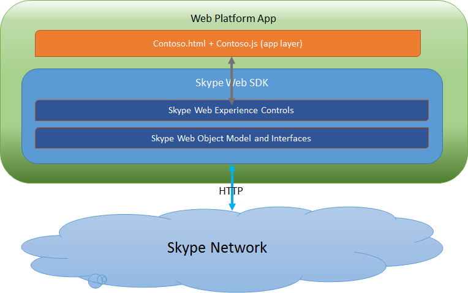

# Skype Web SDK architecture

 _**Applies to:** Skype for Business 2015_

## Architecture

The Skype Web SDK is designed to work in a Model - View - View model (MVVM) paradigm in which the SDK represents the model layer. A developer is responsible for creating a presentation layer and JavaScript logic in the view model layer that calls functions in the model.

The SDK uses common HTTP verbs to implement REST style communication with the Skype for Business server. The Web SDK JavaScript library implements the HTTP request and response handling and exposes a simple presence and conversation API that you use to get and set user availability, get the availability of other users, and start conversations with users. It also handles Basic, integrated, and OAuth user authentication, presence subscription, and conversation operations.

