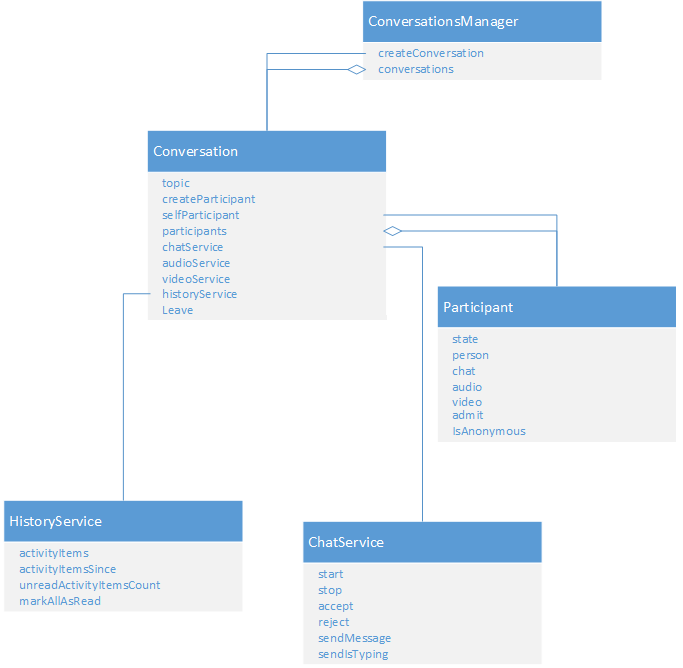
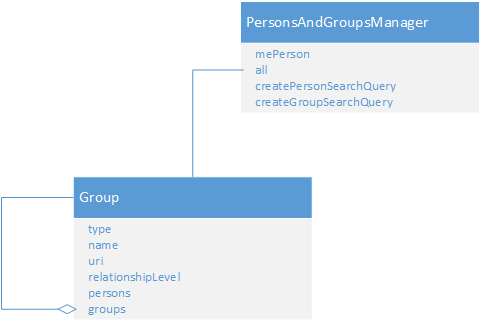

# Groups

 _**Applies to:** Skype for Business 2015_

## What is a group?

A group object is the visual metaphor of a person list view. A [Group]( http://officedev.github.io/skype-docs/Skype/WebSDK/model/api/interfaces/jcafe.group.html) object can be a collection of individual people or it can be a distribution group that is composed of people and other distribution groups. A group can come from any of these sources. Groups are used to create a person list view organized by people groupings.

### Groups

The [Application]( http://officedev.github.io/skype-docs/Skype/WebSDK/model/api/interfaces/jcafe.application.html).[PersonsAndGroupsManager]( http://officedev.github.io/skype-docs/Skype/WebSDK/model/api/interfaces/jcafe.personsandgroupsmanager.html) object provides access to all[Group]( http://officedev.github.io/skype-docs/Skype/WebSDK/model/api/interfaces/jcafe.group.html) objects. The **PersonsAndGroupsManager.all** property returns a single "all" **group**. The "all" [Group.groups]( http://officedev.github.io/skype-docs/Skype/WebSDK/model/api/interfaces/jcafe.group.html#groups) property returns a collection of **group** objects.

The collection returned by  **.groups** contains a **group** of each type including relationship groups, user-created or a server-created[Group]( http://officedev.github.io/skype-docs/Skype/WebSDK/model/api/interfaces/jcafe.group.html) objects. The server created groups include distribution groups and "frequent persons". User created groups are known as "custom groups" and owned by the signed in user. Custom group membership is maintained by using the Skype for Business client.

### Relationships

A collection of relationship [Group]( http://officedev.github.io/skype-docs/Skype/WebSDK/model/api/interfaces/jcafe.group.html) objects is a grouping of persons by work relationship. **RelationshipLevel** include Colleagues, Workgroup, or Blocked.

### Nested Distribution groups

A nested distribution group is a distribution group whose parent is a distribution group. Figure 1 shows a collection of distribution groups returned by a search query. The selected distribution group is opened to show its contents. The distribution group includes two people and another distribution group: "Engineering Desktop Dev All" 

**Figure 1. Nested distribution groups in Skype for Business**

 

The scenario shown by figure 1 is represented in the Skype Web SDK object model by figure 2. The red connector in the diagram represents the nested relationship between parent and child person groups.

The groups collection on the  **application.PersonsAndGroupsManager.all.groups** object represents person groups that a user has added to her person list. This collection can include custom groups and distribution groups. A collection of **groups** returned in a search query contains only distribution groups. Read[PersonsAndGroupsManager]( http://officedev.github.io/skype-docs/Skype/WebSDK/model/api/interfaces/jcafe.personsandgroupsmanager.html) for information about searching for distribution groups.

**Figure 2. Group recursion to represent nested distribution groups**

 

**Nested distribution group persons**: Instead of getting all persons and groups at all nesting levels with one operation, an application must get persons from the **group.persons** collection on distribution group objects at each nesting level. To get deeper nesting levels, an application gets groups from the **group.groups** collection of the current nesting level.

## What can you do with a group?

Build a dynamic view of a user's person list with content from the Groups collection. A group in Skype Web SDK is a read-only object. You can get the name and URI of a person group along with the persons and groups that it contains. You can register a listener callback method to react to changes in the membership of a person group. The listener lets you keep the person list view current. Although a user cannot change the membership of a person group using a Skype Web SDK app, she can change the group by using the native client.

## See also

#### Concepts

[Search for persons and distribution groups](SearchForPersonsAndGroups.md)  
[Manage persons and groups](ManagePersonsAndGroups.md)
