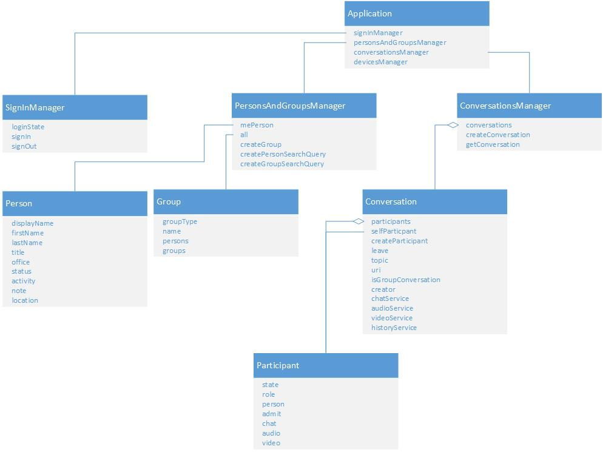

# Skype Web SDK object model


 _**Applies to:** Skype for Business 2015_

 **In this article**  
[Model layer](#sectionSection0)  
[Application object](#sectionSection1)  
[Person list](#sectionSection2)  
[Conversations](#sectionSection3)  
[MePerson object](#sectionSection4)  


The object model is shown in the following figure (Figure 1). Use the [Application](http://officedev.github.io/skype-docs/Skype/WebSDK/model/api/interfaces/jcafe.application.html) constructor and the **new** keyword to create an **Application** object of the [Skype.Web.Model](https://msdn.microsoft.com/library/office/dn962123(v=office.16).aspx)**.Application** type. **Application** is the only object with a constructor. All other objects are obtained according to figure below.

**Figure 1. Object Model**




## Model layer
<a name="sectionSection0"> </a>

The foundation of the SDK is the `Application` model object. It is an object that includes other model objects as members (i.e. `signInManager` or `personsAndGroupsManager`), collections, properties and commands/methods. This section briefly describes the nature of these API types. See an in-depth description in the Property Model section.

- Model objects. These are plain JS objects that are called "model objects" because their members are of the four types: other model objects, observable properties, observable collections and observable commands.
- Properties. These objects are actually functions that keep the current value and provide certain API to deal with that value. The property objects are somewhat similar to the Knockout's observables.
- Collections. They resemble the property objects in many ways, but deal with arrays of values. Internally, a collection is a pair of arrays: values and keys for those values.
- Commands. These are just functions with a boolean observable property called `enabled` that tells if the function can be invoked at the moment. Many commands in the SDK interface are asynchronous and return a promise object.
- Promise. This is the Promise/A+ object that is well decribed elsewhere. In short, it's a object that reprsents a pending asynchronous operation and allows to set callbacks to be invoked once the operation is completed: `p.then(onSuccess, onFailure)`.

`Application` is the only constructor accessible to the app. Internally in the SDK every model object has a constructor, but an app wouldn't be able to invoke it even if it was accessible because those internal constructors need references to many internal objects, such as the "UCWA stack" object or the "contact cache".

The SDK allows to create multiple instance of `Application` and potentially different instances may sign in with different user identities and connect to different UCWA servers. For instance:

```js
app1 = new Application;
app2 = new Application;

app1.signIn({
  username: "johndoe@contoso.com",
  password: "***********"
});

app2.signIn({
  username: "joesmith@abc.com",
  password: "********"
});
```

## Application object
<a name="sectionSection1"> </a>

The [Application](http://officedev.github.io/skype-docs/Skype/WebSDK/model/api/interfaces/jcafe.application.html) object is created by calling the application constructor and is the entry point to the API. Use the **Application#signinManager** to get state change events and signed-in user presence. All operations in the SDK depend on the **Application** object and require that a user is signed in through this object. This object encapsulates a REST communication stack for the signed in user. The functions of this object include:

- Sign a user in using OAUTH, NTLM, or basic authentication with **Application.SignInManager**
    
- Sign a user out with [SignInManager](http://officedev.github.io/skype-docs/Skype/WebSDK/model/api/interfaces/jcafe.signinmanager.html) by using the **Application#signInManager** member.
    
- Get the current sign in state of the user.
    
- Get a reference to the user's person list by reading the **Application#personAndGroups** member. The member references a [PersonAndGroupsManager](http://officedev.github.io/skype-docs/Skype/WebSDK/model/api/interfaces/jcafe.personsandgroupsmanager.html) object.
    
- Get a reference to the conversations that the user has joined by reading the **Application#conversationsManager** member. The member references a [ConversationsManager](http://officedev.github.io/skype-docs/Skype/WebSDK/model/api/interfaces/jcafe.conversationsmanager.html) object.
    
- Get a reference to the available media devices by reading the **Application#devicesManager** member. The member references a [DevicesManager](http://officedev.github.io/skype-docs/Skype/WebSDK/model/api/interfaces/jcafe.devicesmanager.html) object.
    

## Person list
<a name="sectionSection2"> </a>

Access the signed in user's person list by getting a  [Group](http://officedev.github.io/skype-docs/Skype/WebSDK/model/api/interfaces/jcafe.group.html) object on **Application#personsAndGroupsManager.all**:

The **.mePerson** members provides a reference to the [MePerson](http://officedev.github.io/skype-docs/Skype/WebSDK/model/api/interfaces/jcafe.meperson.html) object through [PersonAndGroupsManager](http://officedev.github.io/skype-docs/Skype/WebSDK/model/api/interfaces/jcafe.personsandgroupsmanager.html)**.mePerson**.  

The **.persons** collection contains all of the persons in the person list across all user defined and server defined groups. Contacts in the distribution groups are not in this collection. Use the **.persons** collection to get a **Person** out of the list. This collection is empty unless the application subscribes to it by calling **.subscribe** or fetches the list once with **.get**.

The **.groups** collection encapsulate the person groups that appear in the user's person list. Use the **.groups** collection to get sets of person groups based on:
    
- Privacy relationship to user
    
- Server defined groups
    
- User defined groups
    

## Conversations
<a name="sectionSection3"> </a>

Access the conversations that the user is participating in by reading the [Application#conversationsManager.conversations](http://officedev.github.io/skype-docs/Skype/WebSDK/model/api/interfaces/jcafe.conversationsmanager.html#conversations) collection. If you register a callback for the **.added** event on the conversation collection, your application can accept incoming conversation invitations.


## MePerson object
<a name="sectionSection4"> </a>

The signed in user is encapsulated by the [MePerson](http://officedev.github.io/skype-docs/Skype/WebSDK/model/api/interfaces/jcafe.meperson.html) object obtained from the [PersonAndGroupsManager#mePerson]( http://officedev.github.io/skype-docs/Skype/WebSDK/model/api/interfaces/jcafe.personsandgroupsmanager.html#meperson) property. The [MePerson](http://officedev.github.io/skype-docs/Skype/WebSDK/model/api/interfaces/jcafe.meperson.html) object lets you read and write the following user properties:


- User's current location 
    
- Users personal note 
    
- User presence availability 
    
The following [MePerson](http://officedev.github.io/skype-docs/Skype/WebSDK/model/api/interfaces/jcafe.meperson.html) properties are read-only:


- SIP URI
    
- User Display Name
    
- User presence activity
    
- Work title
    
- Work department
    
- Primary work email
    
- Other email addresses
    
- User photograph URL
    

## See also
<a name="sectionSection4"> </a>


#### Concepts


[Retrieve the API entry point and sign in a user](GetAPIEntrySignIn.md)  
[Show a person's information](ShowPersonInfo.md)  
[Search for persons and distribution groups](SearchForPersonsAndGroups.md)  
[Respond to a conversation invitation](RespondToInvitation.md)  
