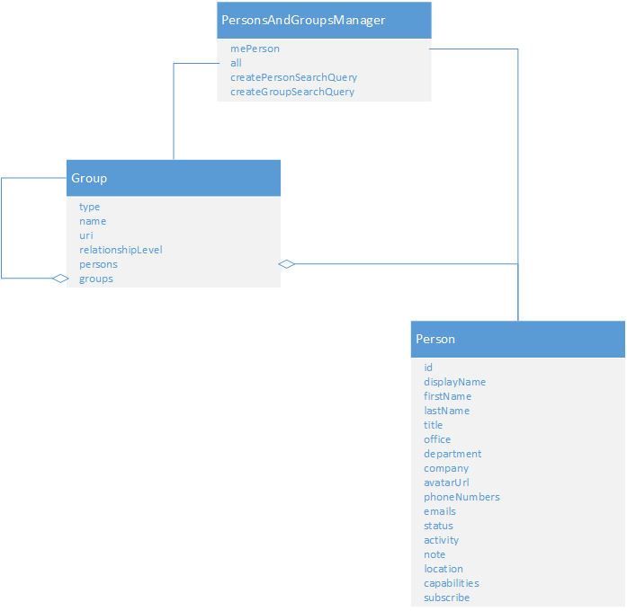

# Persons

 _**Applies to:** Skype for Business 2015_

## 

A [Person]( http://officedev.github.io/skype-docs/Skype/WebSDK/model/api/interfaces/jcafe.person.html) object in Skype Web SDK represents a single person, and contains all the information the user publishes from presence information and a photo, to phone numbers, job title and current location. Persons can also be related in groups and lists.

Figure 1 shows you how to get an instance of the Person object from a user's person list.

**Person object sources in Skype Web SDK**

Each  **Person** object in Skype Web SDK represents a person. You can use a person to represent an known person or an anonymous person, for example Building Three Receptionist. A person cannot represent a phone number or SIP address. The properties of a person can change over time. Every person property has its own value changed event. The person object itself does not provide a general property changed event. If your person view is to be dynamic, you must listen for the events raised by each property of a person. For information about creating a person card view.

## See also

#### Concepts

[Search for persons and distribution groups](SearchForPersonsAndGroups.md)  
[Listening for and generating presence events](PresenceEvents.md)  
[Show a person's information](ShowPersonInfo.md)
