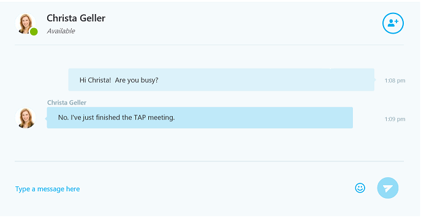

# Use the Skype Web Conversation Control in a webpage

 _**Applies to:** Skype for Business 2015_

 **In this article**  
- [Add the Conversation Control to a webpage](#setup)
- [Render the Conversation Control on an incoming call](#incoming-call)
- [Render the Conversation Control on an outgoing call](#outgoing-call)
- [Render multiple Conversation Controls on a page](#multiple-cc)
- [Additional resources](#additional-resources)

 >**Note**: The Audio and Video components of the conversation control are available as public preview.

The Skype Web SDK <a href="//msdn.microsoft.com/skype/websdk/docs/conversationcontrol" target="">Conversation Control</a> object contains the logic and
presentation layer that encapsulates IM and A/V conversations in one object. Use it when you want Skype
Web SDK to draw the conversation UI for you. It can be implemented in your webpage with as few as three
Skype Web SDK API calls. If you want the control to activate on incoming conversation invitations,
you will need to add an event handler for changes in the self participant chat channel.

To learn about the capabilities of the Conversation Control for each version of the SDK, see
<a href="https://msdn.microsoft.com/skype/websdk/docs/APIProductKeys" target="">Skype Web SDK Production Use Capabilities</a>.

Figure 1 shows the <a href="//msdn.microsoft.com/skype/websdk/docs/conversationcontrol" target="">Conversation Control</a> in action. The Microsoft Edge
browser is shown in this example, but you can use any other supported browser.

**Figure 1. The Skype Web Conversation Control**




This topic takes you through the steps to add a <a href="//msdn.microsoft.com/skype/websdk/docs/conversationcontrol" target="">Conversation Control</a> to you web app. Upon completion of these tasks, 
your app will let a user sign in to Skype for Business on premise, initiate a new IM conversation with one or more people, and accept invitations to 
join an IM conversation.

---
<a name="setup"> </a>
## Add the Conversation Control to a webpage

The below sections walk through the process to initialize the Skype Web SDK API endpoint, add state change event logic for conversation invitations, and a button click 
event handler for starting a new IM conversation.

---
## Initialize the Skype Web SDK API endpoint.

- Declare a structure to hold the API keys
    
>**Important**  The API key values shown in this example are the literal values that you must use in your application. If you use any other strings, 
your application will not initialize the API endpoint.Change the value of the `version` key to uniquely identify your app. See <a href="https://msdn.microsoft.com/skype/websdk/docs/APIProductKeys" target="">Skype Web SDK Production Use Capabilities</a> for a list of supported API keys.

``` js
var config = {
    version: '<my App>/1.0.0', 
    apiKey: 'a42fcebd-5b43-4b89-a065-74450fb91255', // SDK 
    apiKeyCC: '9c967f6b-a846-4df2-b43d-5167e47d81e1' // SDK+CC 
};

```

- Initialize the API endpoint and get the  **UIApplicationInstance** that provides the <a href="//msdn.microsoft.com/skype/websdk/docs/conversationcontrol" target="">Conversation Control</a>.


``` js
Skype.initialize({ apiKey: config.apiKeyCC }, function (api) {
    app = api.UIApplicationInstance;
    //...
});
```

---
<a name='incoming-call'> </a>
## Render Conversation Control on incoming call

Inside of the callback function passed into the  **initialize** method, add a callback to be invoked when a conversation is added to the 
collection on the <a href="http://officedev.github.io/skype-docs/Skype/WebSDK/model/api/interfaces/jcafe.conversationsmanager.html" target="">ConversationsManager</a>.


``` js
app.conversationsManager.conversations.added(function (conversation) {
    //...
});
```

Inside of the previous callback method, add a callback to detect when one of the modalities in the conversation becomes `'Notified'`.

When the state of the channel is changed to `'Notified'`, an invitation to has been received. To show the <a href="//msdn.microsoft.com/skype/websdk/docs/conversationcontrol" target="">Conversation Control</a>, 
call the  **renderConversation** method of the `api` object passed as a parameter to the callback of the **initialize** function.

>note: There is a known issue where adding modalities other than 'Chat' to the 'modalities' array in the second argument
of **renderConversation** causes the Conversation Control to fail to be rendered. Audio and video can still be started later
so it is advised to only pass the array `['Chat']` as the value of the modalities property on the object passed as the
second argument of **renderConversation**.

To render an incoming p2p conversation, invoke **renderConversation** with the sip uri of the sole participant as the only
element of the `participants` array. To render an incoming group conversation, invoke **renderConversation** with the uri of
the incoming group conversation passed as the `conversationId` property in the second parameter of **renderConversation**.

``` js
app.conversationsManager.conversations.added(function (conversation) {
    var options = {};

    if (conversation.isGroupConversation()) {
        options.conversationId = conversation.uri();
    }
    else {
        var participants = [];
        participants.push(conversation.participants(0).person.id());
        options.participants = participants;
    }
    options.modalities = ['Chat'];

    api.renderConversation('#content', options).then(function (conversation) {
        // Resolved promise when conversation is correctly rendered
        console.log('Conversation rendered successfully', conversation);

        // Get notified when Conversation Control receives an incoming call
        conversation.selfParticipant.audio.state.changed(function (newValue, reason, oldValue) {
        // 'Notified' indicates that there is an incoming call
            if (newValue === 'Notified') {
                if (confirm("Would you like to accept this incoming call?")) {
                    setTimeout(function() {
                        // This accepts an incoming call with audio
                        conversation.audioService.accept();

                        // To accept an incoming call with video enabled call
                        // conversation.videoService.accept()
                    }, 0);
                } else {
                    // Reject the incoming call
                    conversation.audioService.reject();
                }
            }
        });

        // Add additional listeners for other modalities (Chat, Video)
    });
});       
```

---
<a name="outgoing-call"> </a>
## Render Conversation Control on outgoing call

The following sample shows you how to render a Conversation Control to represent an outgoing
chat conversation with participants you specify. The sample depends on a couple text input
HTML elements of classes 'sip1' and 'sip2' respectively. 

When the user clicks a button called 'callButton', the code takes the following steps:

- Takes the sip addresses specified in the text inputs sip1 and sip2 and...
    
- Creates a container to host the <a href="//msdn.microsoft.com/skype/websdk/docs/conversationcontrol" target="">Conversation Control</a> and adds it as a child of an element called 'conversationContainer.'
    
- Renders the <a href="//msdn.microsoft.com/skype/websdk/docs/conversationcontrol" target="">Conversation Control</a> in the new container by calling **renderConversation** and passing the hosting container, desired chat modality, and the array of invitee SIP addresses.
    

``` js
var conversationsManager = app.conversationsManager;
var conversation;
var id1 = document.querySelector('.sip1').value;
var id2 = document.querySelector('.sip2').value;
var participants = [];

if (id1 !== '') {
    participants.push(id1);
}
if (id2 !== '') {
    participants.push(id2);
}
if (!id1 && !id2) {
    alert('error, must specify at least 1 SIP Address');
    return;
}

var div = document.createElement('div');
var control = document.querySelector('.conversationContainer');
control.appendChild(div);

api.renderConversation(div, {
    modalities: ['Chat'],
    participants: participants
}).then(function (conversation) {
    // Conversation Control was rendered successfully

    // Add additional listeners for changes to conversation state here (see below section)

    conversation.chatService.start().then(function () {
        // chatService started successfully
    }, function (error) {
        // error starting chatService
    });
}, function (error) {
    // error rendering Conversation Control
});
```

### Observing state changes within the conversation

Once the conversation is rendered, you can also add a number of listeners to observe changes
in the state of the conversation, the states of individual modalities, and participants joining and leaving.
The sample code below shows how to add listeners for participants joining the conversation, and for
changes in the conversation state. These listeners should be added inside the success callback of
the '.then' function after renderConversation.

``` js

listeners.push(conversation.selfParticipant.chat.state.when('Connected', function () {
    // chatService was connected successfully for the selfParticipant
}));

listeners.push(conversation.participants.added(function (person) {
    // Another participant has accepted an invitation and joined the conversation
}));

listeners.push(conversation.state.changed(function (newValue, reason, oldValue) {
    if (newValue === 'Connected' || newValue == 'Conferenced') {
        // Call successfully connected
    }
    if (newValue === 'Disconnected' && (oldValue === 'Connected' || oldValue === 'Connecting' ||
        oldValue === 'Conferenced' || oldValue === 'Conferencing')) {
        // Call disconnected after being connected
    }
}));
```

---
<a name="multi-cc"> </a>
## Render multiple Conversation Controls on a page

Rendering multiple Conversation Controls in the same HTML page is very simple, and follows
the same pattern as adding the first conversation. For each new conversation you want to render,
you need to create a new `<div>` element to hold the new control, add it to the DOM, and pass it
as a parameter to renderConversation, along with the list of participant SIP addresses. The newly
created conversation will be rendered in the specified `<div>` and will be added to the conversations
collection in the model.

``` js
var newParticipants[];
// Add new participant 'sip' addresses to 'newParticipants'
// newParticipants.push(document.querySelector('.sip1').value);
// newParticipants.push(document.querySelector('.sip2').value);
// ...

var newDiv = document.createElement('div');
var control = document.querySelector('.conversationContainer');
control.appendChild(div);

api.renderConversation(div, {
    modalities: ['Chat'],
    participants: newParticipants
}).then(
    // Continue as in 'Render Conversation Control on outgoing call'
);
```

---
<a name="additional-resources"> </a>
## Additional resources

- <a href="//msdn.microsoft.com/skype/websdk/docs/conversationcontrol" target="">Conversation Control</a>


