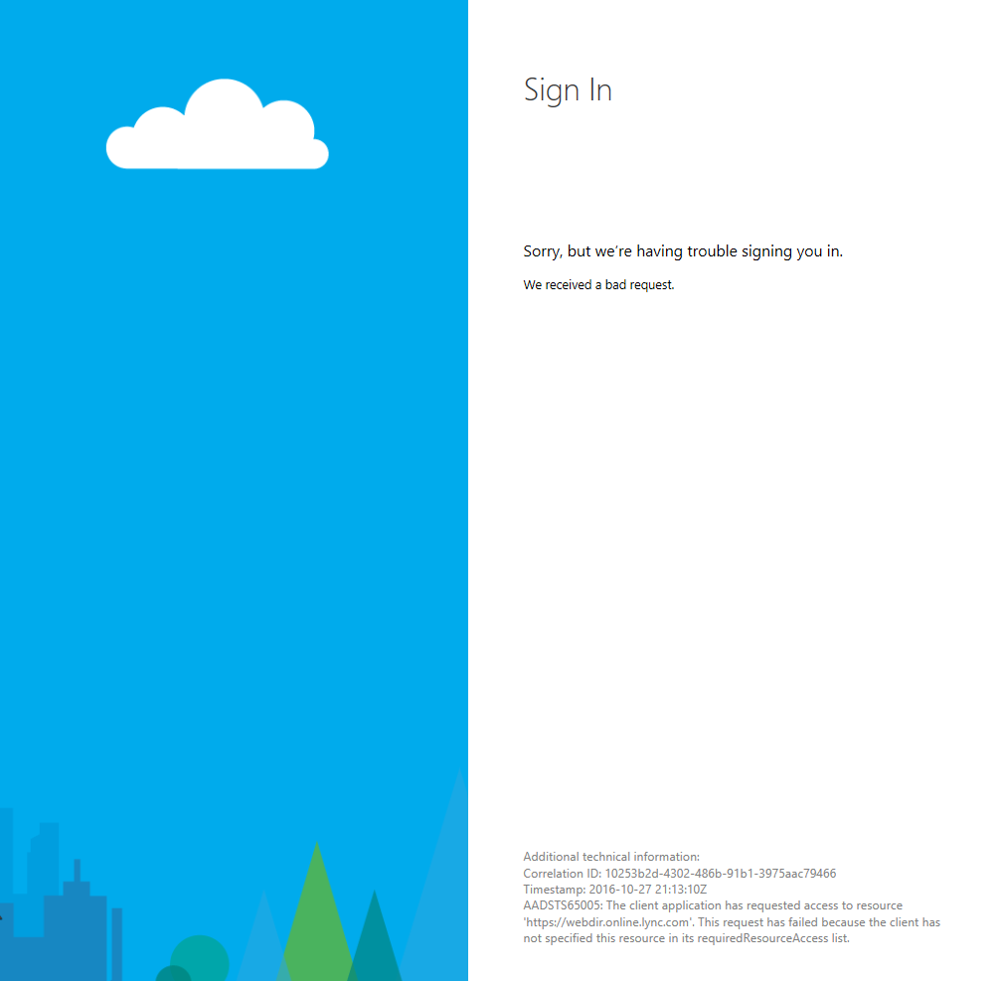
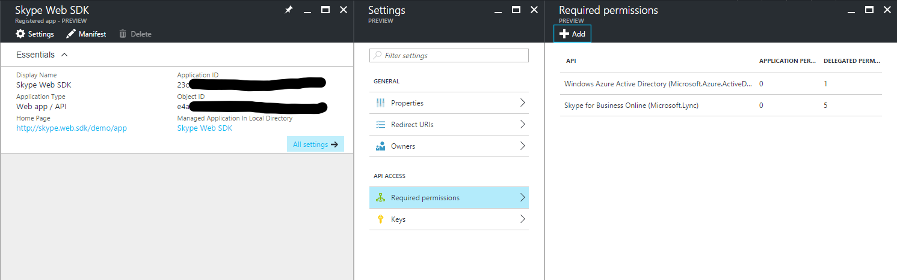
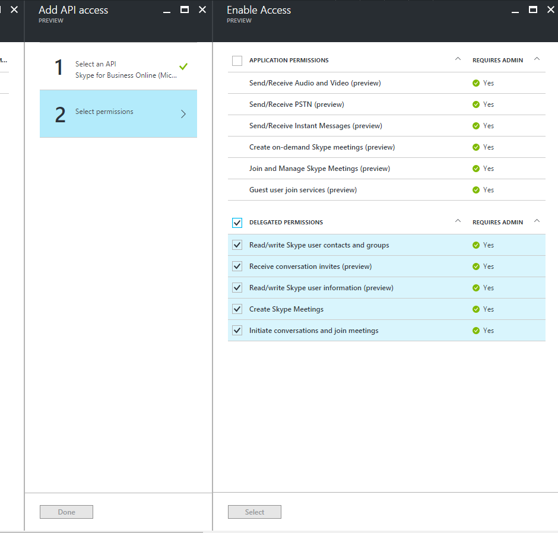
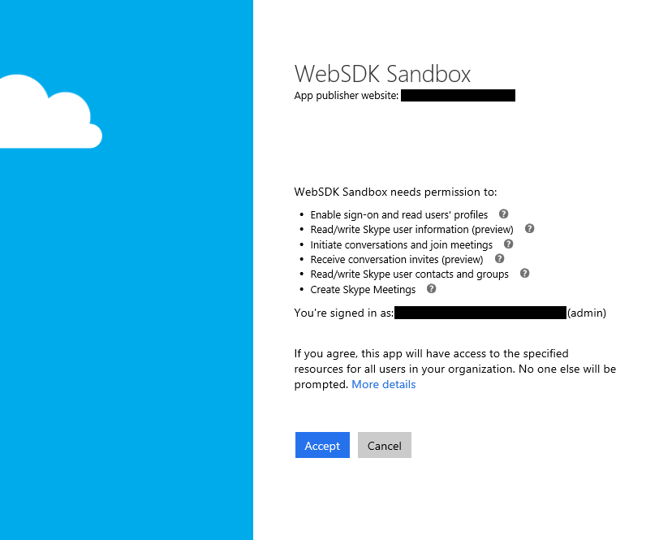

# AAD Auth Failures - Client requesting resource not in requiredResourceAccess list

_"The client application has requested access to resource 'https://webdir.online.lync.com.' request has failed because the client has not specified this resource in its requiredResourceAccess list."_

_**Applies to:** Skype for Business 2015_

**In this article**
- [Who is this article for?](#audience)
- [The Issue](#issue)
- [The Solution](#solution)
- [Related Topics](#related-topics)

## Who is this article for?

If you are attempting to use the Azure AD authentication option to sign into the Skype for Business (SfB) Web SDK and you are seeing an AAD error page that looks like the following then this article is for you. The error page should have the message: "The client application has requested access to resource 'https://webdir.online.lync.com.' request has failed because the client has not specified this resource in its **requiredResourceAccess** list."

If this is not your issue, you can return to [Troubleshooting Azure AD Authentication Failures for Skype Web SDK](./AADAuthFailures.md) for a list of other potential issues.

## The Issue

You did not set permissions for the application to access the SfB Online APIs in Azure AD or set permissions incorrectly.

When registering your Skype Web SDK app in Azure AD, you need to indicate that your web application requires the user (or administrator, in this case) to consent to the app accessing the SfB Online APIs within the context of the authenticated user.
You can find more information about the Azure AD consent framework in [Integrating Applications with Azure Active Directory](https://docs.microsoft.com/en-us/azure/active-directory/active-directory-integrating-applications).

## The Solution

Configure your application to access the SfB Online API by adding the API as one of the resources required by the application. In addition, indicate that your app needs all the delegated permissions made available by the API. Every permission requires administrator consent. This means that the before any user can sign in, an administrator must sign in and consent to the delegated permissions on behalf of all users in the tenant. Once the administrator consents, the application has all the specified delegated permissions in the context of the signed in user.

### Solution steps

1. Sign into **portal.azure.com** with an account that is an administrator in your tenant.
2. Navigate to **Azure Active Directory** in the left side bar > **App registrations** > **Your app** > **All settings**.
3. Under **API Access**, click **Required Permissions**.

   

4. At the top of this pane, click **Add**, then click **Select an API**.
5. Search for **"Skype for Business Online"** (if you don't see results, try **"Microsoft.Lync"**).
6. Click the API that matches the search and click **Select** at the bottom.

   

7. Click all the check boxes next to permissions in the **Delegated Permissions** section and click **Select**. Don't click any of the check boxes under the **Application Permissions** section. Then click **Done** in the **Add API access** pane to the left.

   

8. Now sign into your app with an administrator account and you should be prompted to consent to the delegated permissions you indicated would be required by your app on behalf of all users within your tenant.

> [!NOTE]
> For more information on the difference between these types of permissions, see the section **Configuring a client application to access web APIs** in this article: [Integrating Applications with Azure Active Directory](https://docs.microsoft.com/en-us/azure/active-directory/active-directory-integrating-applications).

Once you accept this prompt, all users in the tenant should be able to sign in and should not have to individually consent to these permissions, since the tenant admin has already consented on their behalf.

If you accidentally click **Cancel** rather than **Accept** and find yourself no longer being prompted to provide admin consent, then you may have to [force AAD to display the admin consent prompt again](./AADAuth-AdminConsent.md).

---

## Related Topics
- [Troubleshooting AAD Auth Failures for Skype Web SDK](./AADAuthFailures.md)
- [AAD Auth Failures - Administrator has not provided consent to use SfB Web APIs](./AADAuth-AdminConsent.md)
- [Integrating Applications with Azure Active Directory](https://docs.microsoft.com/en-us/azure/active-directory/active-directory-integrating-applications)
- [Giving a Web App Access to a Web API](https://docs.microsoft.com/en-us/azure/active-directory/active-directory-authentication-scenarios#web-application-to-web-api)
