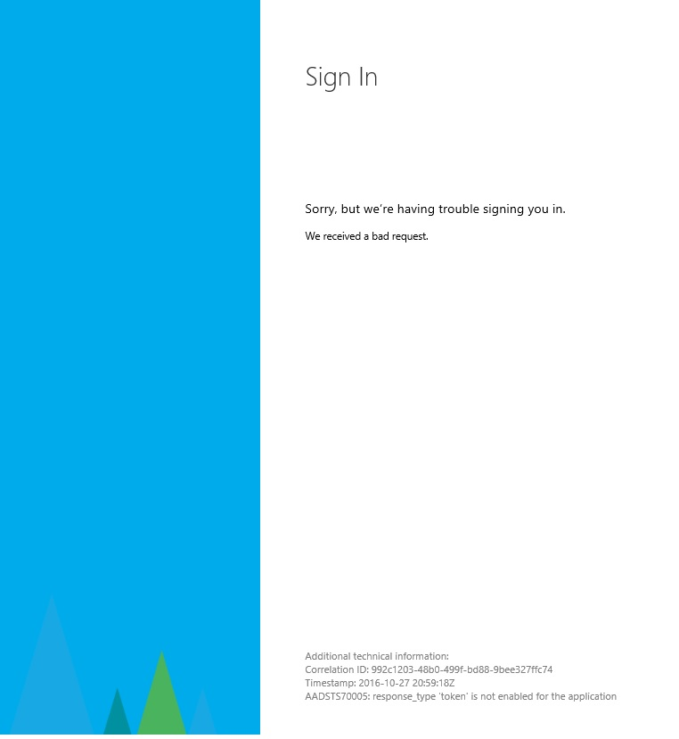
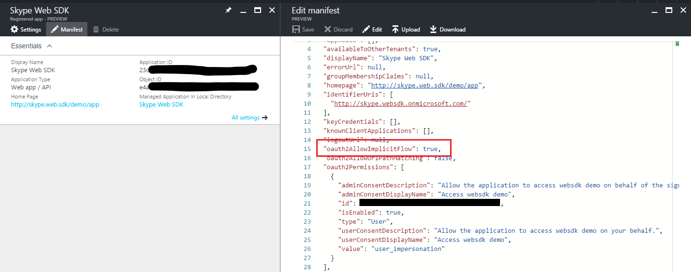

# AAD Auth Failures - Implicit OAuth is not enabled for the application

_"Response_type 'token' is not enabled for the application_"

_**Applies to:** Skype for Business 2015_

**In this article**
- [Who is this article for?](#audience)
- [The Issue](#issue)
- [The Solution](#solution)
- [Related Topics](#related-topics)

## Who is this article for?

If you are attempting to use the Azure AD authentication option to sign into the Skype for Business (SfB) Web SDK and you are seeing an AAD error page that looks like the following then this article is for you. The error page should have the message: "response_type 'token' is not enabled for the application."

If this is not your issue, you can return to [Troubleshooting Azure AD Authentication Failures for Skype Web SDK](./AADAuthFailures.md) for a list of other potential issues.

## The Issue

When creating your app registration in AAD, you need to manually edit the application manifest and set the value of the **oauth2AllowImplicitFlow** property to `true`. Otherwise the AAD sign in flow will not work.

## The Solution

Follow these steps to solve this issue.

1. Sign into **portal.azure.com** with an administrator account in your tenant.
2. Navigate to **Azure Active Directory** in the left hand side bar > **App registrations** > **Your app**.
3. Click **Manifest** at the top of the pane describing your app.
4. Change the value of the property **oauth2AllowImplicitFlow** to `true`. If the property is not present, add it and set its value to `true`.

   

5. Click **Save** to save the modified manifest.

---

## Related Topics

- [Troubleshooting AAD Auth Failures for Skype Web SDK](./AADAuthFailures.md)
- [Integrating Applications with Azure Active Directory](https://docs.microsoft.com/en-us/azure/active-directory/active-directory-integrating-applications)
