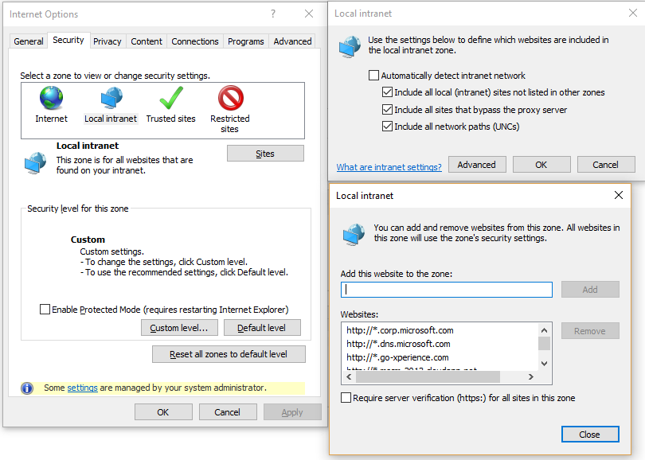

# AAD Auth Failures - Crossing security zones in Internet Explorer and Microsoft Edge

_**Applies to:** Skype for Business 2015_

**In this article**
- [Who is this article for?](#audience)
- [The Issue](#issue)
- [The Solution](#solution)
- [Related Topics](#related-topics)

<a name="audience"></a>
## Who is this article for?

This article only applies to user error experiences where the browser in use is Internet Explorer (IE) or Microsoft Edge (Edge). 

If you are using the Azure AD authentication option to sign into the Skype for Business (SfB) Web SDK in Internet Explorer (IE), you are successfully authenticating to Azure AD and getting redirected back to your web application, and then your sign in fails silently or hangs indefinitely, then this article is for you. 

This is especially likely to be an issue if you are hosting your application on **http://localhost** during development. If this issue is occurring in a production deployment, skip to [Crossing Security Zones in Production](#prod-solution).

If the previous failure description seems to match your user's experience but the user is not on IE or Edge then you should return to [Troubleshooting Azure AD Authentication Failures for Skype Web SDK](./AADAuthFailures.md) for a list of other potential issues.

<a name="issue"></a>
## The Issue

Before spending a long time looking at web traffic to detect the issue, try the simple solution proposed by this article. If you want to confirm that this is the specific issue you're hitting, you can use [Fiddler](http://www.telerik.com/fiddler) or [Charles](https://www.charlesproxy.com/) to monitor web traffic between your application and the server. If you have this issue, in your web traffic somewhere after authenticating with AAD, redirecting back to your app page, and initiating signin with **signInManager.signIn**, you will see a request to **login.microsoftonline.com** that returned a redirect response. Upon inspecting it, you will see that the fragment of the url itself contains an error, which will say something like this:

> ADSTS50058: A silent sign-in request was sent but no user is signed in. The cookies used to represent the user's session were not sent in the request to Azure AD. This can happen if the user is using Internet Explorer or Edge, and the web app sending the silent sign-in request is in different IE security zone than the Azure AD endpoint

<a name="solution"></a>
## The Solution

To fix this issue, you need to ensure that the page where you're hosting your app and the AAD sign in page are treated as though they're in the same security zone.

If this error is occurring during development, the recommended way to fix this is to modify your machine's **hosts** file to map some dummy domain name (eg. **app.myapp.com**) to the IP address of **localhost** (127.0.0.1). On a PC, you can follow these instructions to do this:

1. Open **Command Prompt** or another terminal in _administrator mode_.
2. Enter the following command to go to the directory with the hosts file:

   ```C:\> cd C:\Windows\System32\drivers\etc```

3. Enter the following to open the hosts file in administrator mode in Notepad

   ```C:\Windows\System32\drivers\etc> notepad hosts```

4. Add the following line to the bottom of the file to add an entry mapping **app.myapp.com** to the IP address of **localhost**:

   ```127.0.0.1 		app.myapp.com```

5. Save the file. If it prompts you to 'save as' rather than just 'save,' you probably did not open the file in administrator mode. You must be in administrator mode to modify the **hosts** file.

 If you've done this correctly, you should now be able to open a browser, navigate to **http://app.myapp.com** and see the same page you were hosting before on **localhost** because the domain name **app.myapp.com** is being resolved to the same IP address as **localhost**. However now when you try to sign in, your browser should treat **app.myapp.com** as though it is in the "internet" security zone where the AAD sign in page is located, rather than in the "intranet" security zone where **localhost** is. You will also have to add the new dummy url to your list of valid reply URLs in the app registration in AAD. For instructions on how to do that, see [AAD Auth Failures - Incorrectly configured reply URLs for application](./AADAuth-ReplyURLs.md). If you have done all this correctly your signin should complete successfully.

> [!WARNING]
> Modifying the **hosts** file is a significant operation and could have an impact on other programs or services. We recommend that you only use this solution during development and undo this change after testing and deploying your app.

<a name="prod-solution"></a>
## Crossing Security Zones in Production

If this error is encountered in a production deployment where the application is no longer being hosted on **localhost**, then the solution is to manually remove the hosting web application from the Intranet/Trusted security zone.

1. In IE, open Internet Options
2. Go to **Security** > **Local intranet** > **Sites** > **Advanced**
3. Remove the domain name of the site hosting your web application from the list.

 

You may need to contact your IT administrator as well and ask them to remove any group policy rules that are putting your web application back into the Intranet/Trusted security zones.

---

<a name="related-topics"></a>
## Related Topics:

- [Troubleshooting AAD Auth Failures for Skype Web SDK](./AADAuthFailures.md)
- [AAD Auth Failures - Incorrectly configured reply URLs for application](./AADAuth-ReplyURLs.md)
- [Integrating Applications with Azure Active Directory](https://docs.microsoft.com/en-us/azure/active-directory/active-directory-integrating-applications)
