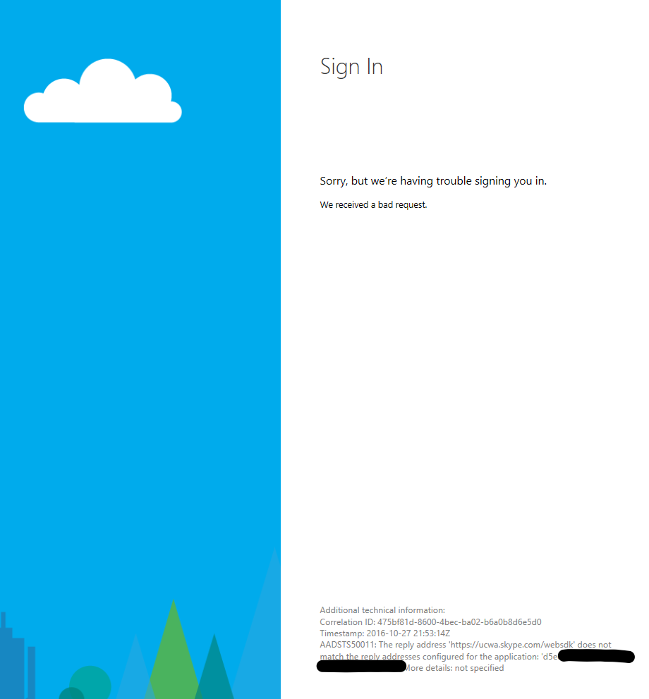
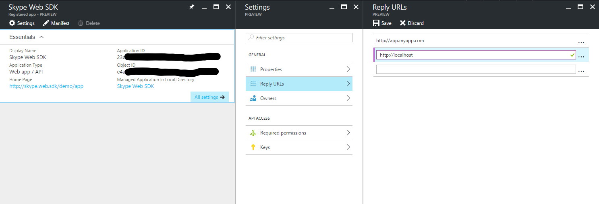

# AAD Auth Failures - Incorrectly configured reply URLs for application

_"The reply address 'https://...' does not match the reply addresses configured for the application <...>"_

_**Applies to:** Skype for Business 2015_

**In this article**
- [Who is this article for?](#audience)
- [The Issue](#issue)
- [The Solution](#solution)
- [Related Topics](#related-topics)

<a name="audience"></a>
## Who is this article for?

If you are attempting to use the Azure AD authentication option to sign into the Skype for Business (SfB) Web SDK and you are seeing an AAD error page that looks like the following then this article is for you. The error page should have this message: "The reply address 'https://...' does not match the reply addresses configured for the application <...>"



If this is not your issue, you can return to [Troubleshooting Azure AD Authentication Failures for Skype Web SDK](./AADAuthFailures.md) for a list of other potential issues.

<a name="issue"></a>
## The Issue

You either have not configured the URL where you're hosting your app as a valid reply URL in the registration of your app in AAD, or you have not specified the correct url as the **redirect_uri** query parameter of the URL when redirecting to the AAD sign in page to allow the user to enter credentials.

<a name="solution"></a>
## The Solution

You need to configure the main domain name where you're hosting your app as a reply URL in the AAD registration for your app and pass it as the **redirect_uri** when redirecting to AAD to allow the user to sign in.

You should be using code like this to redirect the user to enter her credentials to sign into Azure AD:

``` js
var href = 'https://login.microsoftonline.com/common/oauth2/authorize?response_type=token&client_id=';
href += client_id + '&resource=https://webdir.online.lync.com&redirect_uri=' + window.location.href;
window.location.href = href;
```

Note in the code above that we are using **window.location.href** as the value of the **redirect_uri** query parameter in forming the URL of the AAD endpoint where the user will sign in. This parameter tells AAD to redirect the client browser and the access token obtained by signing into AAD back to the page we're currently on - the main app page. However, AAD will only redirect the access token to URLs that are specified as Reply URLs in the app registration in AAD. Follow these steps to check your configured Reply URLs and add additional ones:

1. Sign into **portal.azure.com** with an account that's an administrator on your tenant.
2. Navigate to **Azure Active Directory** in the left side bar > **App registrations** > **Your app** > **All settings** > **Reply URLS**.
3. Type the domain name where you're hosting your app (eg. **http://localhost** or **http://app.myapp.com**) and click **Save**.



> [!NOTE]
> Protocol matters. AAD will treat **http://website.com** and **https://website.com** as different reply URLs. If you are still having an issue after following the steps above, check that the configured reply URL matches the protocol you're actually using.

> [!WARNING]
> We do not recommend that production apps leave **localhost** configured as a reply URL. You should only use this for local development and testing, and remove it from the list of reply URLs once your app is hosted on a domain you own.

---

<a name="related-topics"></a>
## Related Topics

- [Troubleshooting AAD Auth Failures for Skype Web SDK](./AADAuthFailures.md)
- [Integrating Applications with Azure Active Directory](https://docs.microsoft.com/en-us/azure/active-directory/active-directory-integrating-applications)

