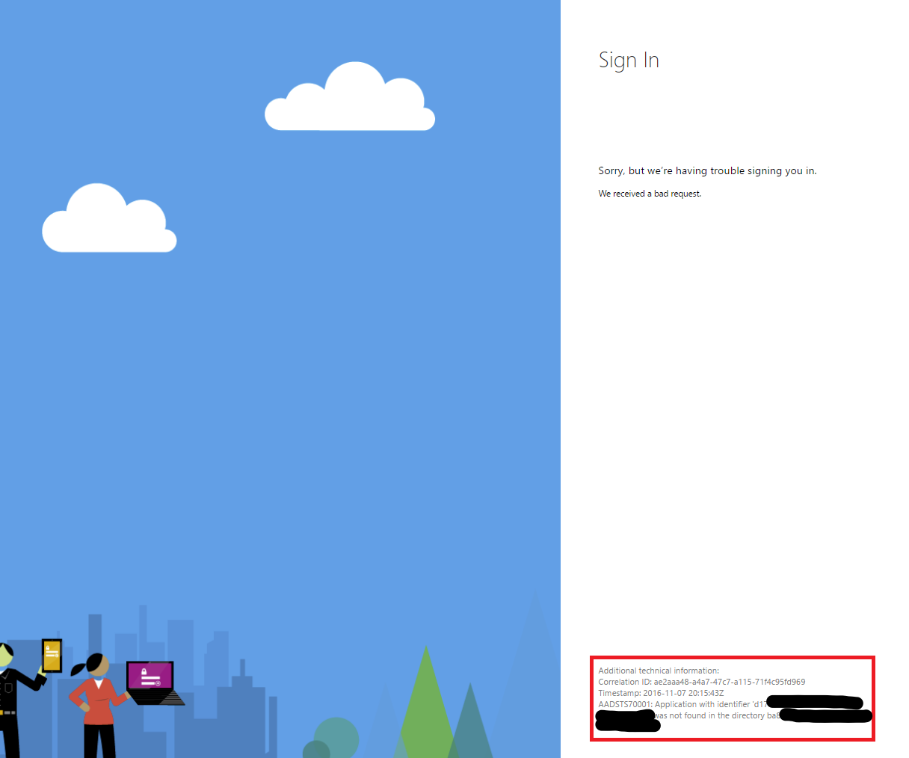

# Troubleshooting Azure AD Authentication Failures for Skype Web SDK

_**Applies to:** Skype for Business 2015_

**In this article**
- [Common AAD Sign in Error Messages](#error-messages)
- [Other common AAD Authentication Failures](#other-failures)
- [AAD Authentication Failures in Internet Explorer and Microsoft Edge](#MS-specific)
- [Related Topics](#related-topics)
- [External Resources](#external-resources)

If you are developing an application with the Skype Web SDK and [authenticating using Azure Active Directory (AAD)](../../PTAuthAzureAD.md) and users are experiencing some kind of error then this article is for you.

Depending on the specific failure case you are experiencing while trying to authenticate to the Skype Web SDK, this article provides specific guidance to fix your issue. 

## Common AAD Signin Error Messages

If your user is redirected to the AAD sign in page, enters correct credentials for a Skype for Business Online user, and gets to an error page with the text "Sorry, but we're having trouble signing you in," there is a small section in the bottom right of the page labeled **Additional technical information**. This section provides a more specific error message to figure out exactly what is going wrong with the user's sign in attempt.

This is an example of the error page. Look for your specific error in the **Additional technical information** area indicated by the rectangle.

Based on the type of error message a user sees, choose from the following links for specific instructions to fix the error message. You could have multiple errors, and after fixing one you might have to return here to fix another.

### Providing incorrect client ID

_"Calling principal cannot consent due to lack of permissions."_

This error indicates you have probably specified an incorrect **client_id** value when redirecting to the AAD sign in page.
Read [AAD Auth Failures - Providing incorrect client ID](./AADAuth-ClientID.md) to learn how to correct the error.

### Client requesting resource not in requiredResourceAccess list

_"The client application has requested access to resource 'https://webdir.online.lync.com.' request has failed because the client has not specified this resource in its requiredResourceAccess list."_

This error indicates that you have not configured your AAD app to be able to access the Skype for Business Online APIs.
Read [AAD Auth Failures - Client requesting resource not in requiredResourceAccess list](./AADAuth-DelegatePermissions.md) to learn how to correct the error.

### Incorrectly configured reply URLs for application

_"The reply address 'https://...' does not match the reply addresses configured for the application <...>"_

This error indicates that the redirect uri you specified when navigating to the AAD sign in page has not been configured as one of the valid "Reply URLs" for the app in AAD.
Read [AAD Auth Failures - Incorrectly configured reply URLs for application](./AADAuth-ReplyURLs.md) to learn how to correct this.

### Administrator has not provided consent to use SfB Web APIs

_"Calling principal cannot consent due to lack of permissions."_

This error indicates that the user attempting to sign in cannot consent to use some external resource that the AAD application configuration specifies it must consent to. This is most likely because an administrator in the tenant has to sign in first and grant permission on behalf of all non-administrator users in the tenant.
Read [AAD Auth Failures - Administrator has not provided consent to use SfB Web APIs](./AADAuth-AdminConsent.md) to learn how to correct the error.

### Implicit OAuth is not enabled for the application

_"Response_type 'token' is not enabled for the application_"

This error indicates that you still have to manually edit the application manifest in AAD to enable the implicit OAuth sign in flow.
Read [AAD Auth Failures - Implicit OAuth is not enabled for the application](./AADAuth-EnableImplicitOAuth.md) to learn how to correct the error.

## Other Common AAD Authentication Failures

Some failures are a little more difficult to detect because the app will silently fail to sign in instead of redirecting to an error page with a helpful error message. You might need to use a web debugging proxy such as [Fiddler](http://www.telerik.com/fiddler) or [Charles](https://www.charlesproxy.com/) to identify what request is failing. The error message can sometimes be buried in an HTTP response that appears successful, such as in a response where the body is an HTML page with an error message hidden somewhere on the page.

### No CORS

If you attempt to call **signInManager.signIn** after being redirected back from the AAD signin page and fail to specify the **cors: true** option, the signin will fail silently with a **HTTP 403 Forbidden** response.

The solution is to:

- Add the **cors** parameter to your sign in options object 
- Set the value of the **redirect_uri** parameter to a valid empty html file in an existing subfolder of your main app directory, eg: "path/to/subfolder/emptypage.html"

> [!NOTE]
> In Internet Explorer and Microsoft Edge, this file may be necessary for passing the OAuth token back from AAD and forward when signing in to SfB online.

### AAD Authentication Failures in Internet Explorer and Microsoft Edge

There are two failures that occur only on Internet Explorer and Microsoft Edge. In both of these cases, the user experiences the following:

- The user is redirected to the AAD sign-in page
- Appear to authenticate successfully
- Redirect back
- Silently fail to sign in back on the app page. 

Use [Fiddler](http://www.telerik.com/fiddler) or [Charles](https://www.charlesproxy.com/) to get a better clue of what the actual failure is, but here are a couple common ones.

#### Crossing security zones in Internet Explorer and Microsoft Edge

If you are hosting a web app temporarily on **http://localhost**, and your app is silently failing to sign in once redirected back, it may be because the browser is blocking cookies from being transferred between internet "security zones." The trusted zone of **localhost** and the external AAD sign in page are in different security zones by default.

Read [AAD Auth Failures - Crossing security zones in Internet Explorer and Microsoft Edge](./AADAuth-IESecurityZones.md) to learn on how to correct the error.

#### Invalid CORS redirect URI in Internet Explorer and Microsoft Edge

In Internet Explorer and Microsoft Edge, the authentication token obtained when signing into AAD can sometimes be lost upon being redirected back to the original app page. Providing a valid placeholder html file in a subfolder of your main app directory can serve as a place for AAD to store and retrieve the OAuth token.

Read [AAD Auth Failures - Invalid CORS redirect URI in Internet Explorer and Microsoft Edge](./AADAuth-IECORSRedirectURI.md) to learn how to correct the error.

---

## Related Topics

- [Authentication using Azure Active Directory (AAD)](../../PTAuthAzureAD.md)
- [Integrating Applications with Azure Active Directory](https://docs.microsoft.com/en-us/azure/active-directory/active-directory-integrating-applications)
- [Gathering Web Traffic Logs using the Skype Web SDK](../gatheringLogs/Logs-WebTraffic.md)

## External Resources

- [Get and set up Fiddler](http://docs.telerik.com/fiddler/Configure-Fiddler/Tasks/InstallFiddler)
- [Configure Fiddler to decrypt HTTPS traffic](http://docs.telerik.com/fiddler/Configure-Fiddler/Tasks/DecryptHTTPS)
