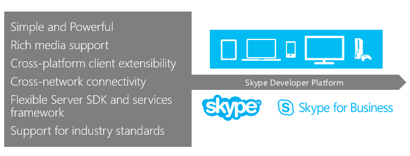

 #Skype for Business

Build integrated communications experiences and solutions to leverage the power and reach of Skype and Skype for Business.

Use the Skype network to optimize communications and to build better relationships between people who "just" want to connect and communicate. We're building out one of the largest communications environments with Skype, Skype for Business, and Skype for Business Online in Office 365. This powerful platform provides video, voice, IM, and other types of communications capabilities. We also provide SDKs that help customers and partners  extend the capabilities of our platform, Android and iOS mobile platforms, meet specific business requirements, and close their gaps in end-to-end communications and collaborations processes.

- [Skype URIs](https://msdn.microsoft.com/en-us/library/office/dn745878.aspx)
- [Skype Web SDK](WebSDK/docs/SkypeWebSDK.md)
- [Skype for Business App SDK Preview](AppSDK/SkypeAppSDK.md)
- [Skype for Business - Mobile URIs](Skype-For-Business-Uris/SfBMobileURI.md)
- [Desktop components](https://msdn.microsoft.com/en-us/library/office/jj933180.aspx)
- [Unified Communications Managed API (UCMA)](https://msdn.microsoft.com/en-us/library/office/dn454984(v=office.16).aspx)
- [Unified Communications Web API](ucwa/UnifiedCommunicationsWebAPI2_0.md)
- [Skype for Business SDN Interface](SDN/articles/skype-for-business-sdn-interface.md)

Related sites 
- [Skype](http://www.skype.com/en/)
- [Skype Developer Platform](http://dev.office.com/skype)
- [Introducing Skype for Business](http://blogs.skype.com/2014/11/11/introducing-skype-for-business/)
- [Skype for Business Server 2015](https://technet.microsoft.com/en-us/library/gg398616.aspx)

